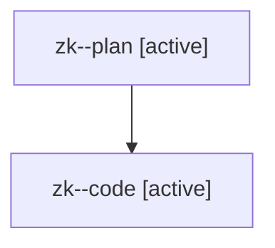

# Family: zk

[Agent Hoods](../README.md) / [bbugyi200](../users/bbugyi200/README.md) / [athena](../users/bbugyi200/machines/athena/README.md) / [zk](../users/bbugyi200/machines/athena/hoods/zk/README.md) / zk

Owner: `bbugyi200.athena` · Hood: `zk` · Members: 2

## Lineage

The diagram is an optional enhancement; the ordered table below contains the same lineage in accessible text.

| Role | Agent | State | Model / provider | Timing | Commits | Prompt | Chat |
|---|---|---|---|---|---:|---|---|
| plan | zk--plan | active | opus / claude | 2026-08-13T14:41:16.135976+00:00 | 0 | [Prompt](../agents/bbugyi200.athena.zk--plan/prompt.md) | [Chat](../agents/bbugyi200.athena.zk--plan/chat.md) |
| code | zk--code | active | gpt-5.5 / codex | 2026-08-13T14:50:42.291381+00:00 | [1](../agents/bbugyi200.athena.zk--code/README.md#commits) | — | — |

## Commits

| Role | Repo | Commit | Subject | Committed |
|---|---|---|---|---|
| code | sase | [`bce09f8`](https://github.com/sase-org/sase/commit/bce09f8bf57fb88410089c961da83850415bb1c3) | fix(tui): normalize queue duration timestamps | 2026-08-13 11:07:49 EDT |
