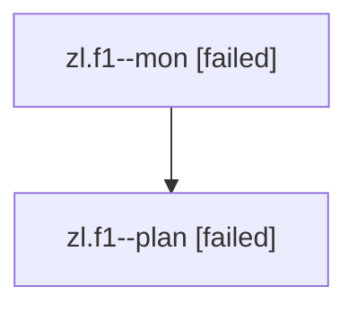

# Family: zl.f1

[Agent Hoods](../README.md) / [bbugyi200](../users/bbugyi200/README.md) / [athena](../users/bbugyi200/machines/athena/README.md) / [zl](../users/bbugyi200/machines/athena/hoods/zl/README.md) / zl.f1

Owner: `bbugyi200.athena` · Hood: `zl` · Members: 2

## Lineage

The diagram is an optional enhancement; the ordered table below contains the same lineage in accessible text.

| Role | Agent | State | Model / provider | Timing | Commits | Prompt | Chat |
|---|---|---|---|---|---:|---|---|
| mon | zl.f1--mon | failed | opus / claude | 2026-08-13T16:21:24.224132+00:00 | 0 | — | [Chat](../agents/bbugyi200.athena.zl.f1--mon/chat.md) |
| plan | zl.f1--plan | failed | opus / claude | 2026-08-13T16:07:08.986901+00:00 | 0 | [Prompt](../agents/bbugyi200.athena.zl.f1--plan/prompt.md) | [Chat](../agents/bbugyi200.athena.zl.f1--plan/chat.md) |

## Neighbors

| Agent | Relation | State |
|---|---|---|
| [zl](../agents/bbugyi200.athena.zl/README.md) | ancestor | completed |
| [zl.w0](bbugyi200.athena.zl.w0.md) (family · 2) | zl hood | active 2 |
| [zl.w1](../agents/bbugyi200.athena.zl.w1/README.md) | zl hood | dismissed |
