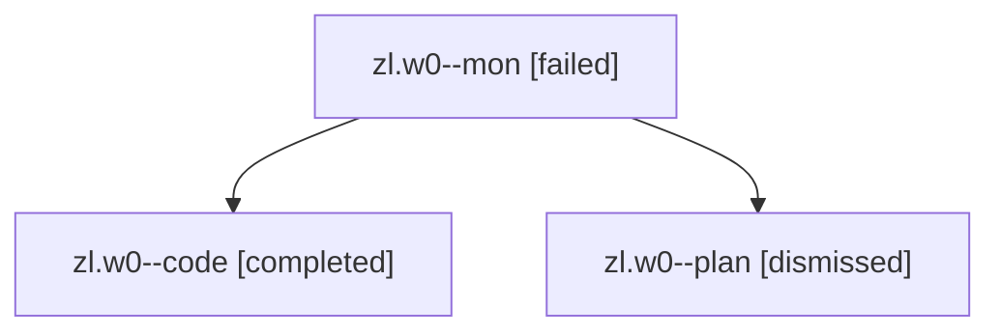

# Family: zl.w0

[Agent Hoods](../README.md) / [bbugyi200](../users/bbugyi200/README.md) / [athena](../users/bbugyi200/machines/athena/README.md) / [zl](../users/bbugyi200/machines/athena/hoods/zl/README.md) / zl.w0

Owner: `bbugyi200.athena` · Hood: `zl` · Members: 3

## Lineage

The diagram is an optional enhancement; the ordered table below contains the same lineage in accessible text.

| Role | Agent | State | Model / provider | Timing | Commits | Prompt | Chat |
|---|---|---|---|---|---:|---|---|
| mon | zl.w0--mon | failed | sonnet / claude | 2026-08-13T16:53:44.162449+00:00 | 0 | — | [Chat](../agents/bbugyi200.athena.zl.w0--mon/chat.md) |
| code | zl.w0--code | completed | sonnet / claude | 2026-08-13T16:20:58.231926+00:00 | 0 | — | [Chat](../agents/bbugyi200.athena.zl.w0--code/chat.md) |
| plan | zl.w0--plan | dismissed | opus / claude | 2026-08-13T12:08:39.576508 → 2026-08-13T12:53:58.350007 | 0 | — | [Chat](../agents/bbugyi200.athena.zl.w0--plan/chat.md) |

## Neighbors

| Agent | Relation | State |
|---|---|---|
| [zl](../agents/bbugyi200.athena.zl/README.md) | ancestor | completed |
| [zl.f1](bbugyi200.athena.zl.f1.md) (family · 2) | zl hood | failed 2 |
| [zl.w1](../agents/bbugyi200.athena.zl.w1/README.md) | zl hood | dismissed |
