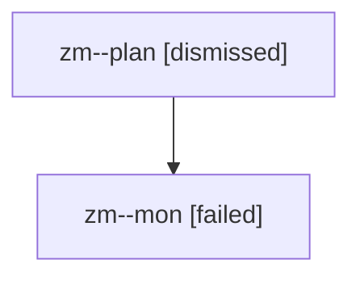

# Family: zm

[Agent Hoods](../README.md) / [bbugyi200](../users/bbugyi200/README.md) / [athena](../users/bbugyi200/machines/athena/README.md) / [zm](../users/bbugyi200/machines/athena/hoods/zm/README.md) / zm

Owner: `bbugyi200.athena` · Hood: `zm` · Members: 2

## Lineage

The diagram is an optional enhancement; the ordered table below contains the same lineage in accessible text.

| Role | Agent | State | Model / provider | Timing | Commits | Prompt | Chat |
|---|---|---|---|---|---:|---|---|
| plan | zm--plan | dismissed | opus / claude | 2026-08-13T12:15:11.895610 → 2026-08-13T12:24:59.948131 | 0 | — | — |
| mon | zm--mon | failed | opus / claude | 2026-08-13T16:25:44.860174+00:00 | 0 | — | [Chat](../agents/bbugyi200.athena.zm--mon/chat.md) |
