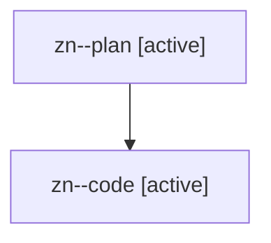

# Family: zn

[Agent Hoods](../README.md) / [bbugyi200](../users/bbugyi200/README.md) / [athena](../users/bbugyi200/machines/athena/README.md) / [zn](../users/bbugyi200/machines/athena/hoods/zn/README.md) / zn

Owner: `bbugyi200.athena` · Hood: `zn` · Members: 2

## Lineage

The diagram is an optional enhancement; the ordered table below contains the same lineage in accessible text.

| Role | Agent | State | Model / provider | Timing | Commits | Prompt | Chat |
|---|---|---|---|---|---:|---|---|
| plan | zn--plan | active | opus / claude | 2026-08-13T16:20:28.028975+00:00 | 0 | [Prompt](../agents/bbugyi200.athena.zn--plan/prompt.md) | [Chat](../agents/bbugyi200.athena.zn--plan/chat.md) |
| code | zn--code | active | gpt-5.5 / codex | 2026-08-13T16:39:40.317749+00:00 | [1](../agents/bbugyi200.athena.zn--code/README.md#commits) | — | — |

## Commits

| Role | Repo | Commit | Subject | Committed |
|---|---|---|---|---|
| code | sase | [`4c93037`](https://github.com/sase-org/sase/commit/4c93037c8ae24b178e9590db4b3fcb27a0adc9e5) | feat(memory): number generated agent docs by document | 2026-08-13 13:04:26 EDT |
