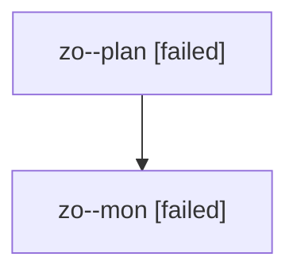

# Family: zo

[Agent Hoods](../README.md) / [bbugyi200](../users/bbugyi200/README.md) / [athena](../users/bbugyi200/machines/athena/README.md) / [zo](../users/bbugyi200/machines/athena/hoods/zo/README.md) / zo

Owner: `bbugyi200.athena` · Hood: `zo` · Members: 2

## Lineage

The diagram is an optional enhancement; the ordered table below contains the same lineage in accessible text.

| Role | Agent | State | Model / provider | Timing | Commits | Prompt | Chat |
|---|---|---|---|---|---:|---|---|
| plan | zo--plan | failed | opus / claude | 2026-08-13T17:15:08.249900+00:00 | 0 | [Prompt](../agents/bbugyi200.athena.zo--plan/prompt.md) | [Chat](../agents/bbugyi200.athena.zo--plan/chat.md) |
| mon | zo--mon | failed | opus / claude | 2026-08-13T17:37:21.801499+00:00 | 0 | — | [Chat](../agents/bbugyi200.athena.zo--mon/chat.md) |
