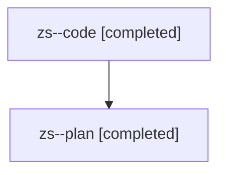

# Family: zs

[Agent Hoods](../README.md) / [bbugyi200](../users/bbugyi200/README.md) / [athena](../users/bbugyi200/machines/athena/README.md) / [zs](../users/bbugyi200/machines/athena/hoods/zs/README.md) / zs

Owner: `bbugyi200.athena` · Hood: `zs` · Members: 2

## Lineage

The diagram is an optional enhancement; the ordered table below contains the same lineage in accessible text.

| Role | Agent | State | Model / provider | Timing | Commits | Prompt | Chat |
|---|---|---|---|---|---:|---|---|
| code | zs--code | completed | gpt-5.5 / codex | 2026-08-13T17:46:00.660962+00:00 | [1](../agents/bbugyi200.athena.zs--code/README.md#commits) | — | [Chat](../agents/bbugyi200.athena.zs--code/chat.md) |
| plan | zs--plan | completed | opus / claude | 2026-08-13T17:36:34.962487+00:00 | 0 | [Prompt](../agents/bbugyi200.athena.zs--plan/prompt.md) | [Chat](../agents/bbugyi200.athena.zs--plan/chat.md) |

## Commits

| Role | Repo | Commit | Subject | Committed |
|---|---|---|---|---|
| code | sase | [`0623414`](https://github.com/sase-org/sase/commit/0623414e3b4226b26f587d94fd6bbbd8d66df4d7) | feat(tui): add wait modal field navigation | 2026-08-13 17:57:58 UTC |
