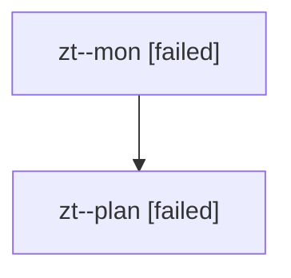

# Family: zt

[Agent Hoods](../README.md) / [bbugyi200](../users/bbugyi200/README.md) / [athena](../users/bbugyi200/machines/athena/README.md) / [zt](../users/bbugyi200/machines/athena/hoods/zt/README.md) / zt

Owner: `bbugyi200.athena` · Hood: `zt` · Members: 2

## Lineage

The diagram is an optional enhancement; the ordered table below contains the same lineage in accessible text.

| Role | Agent | State | Model / provider | Timing | Commits | Prompt | Chat |
|---|---|---|---|---|---:|---|---|
| mon | zt--mon | failed | opus / claude | 2026-08-13T18:11:55.195112+00:00 | 0 | — | [Chat](../agents/bbugyi200.athena.zt--mon/chat.md) |
| plan | zt--plan | failed | opus / claude | 2026-08-13T18:03:55.305532+00:00 | 0 | [Prompt](../agents/bbugyi200.athena.zt--plan/prompt.md) | [Chat](../agents/bbugyi200.athena.zt--plan/chat.md) |
