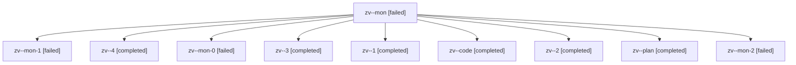

# Family: zv

[Agent Hoods](../README.md) / [bbugyi200](../users/bbugyi200/README.md) / [athena](../users/bbugyi200/machines/athena/README.md) / [zv](../users/bbugyi200/machines/athena/hoods/zv/README.md) / zv

Owner: `bbugyi200.athena` · Hood: `zv` · Members: 10

## Lineage

The diagram is an optional enhancement; the ordered table below contains the same lineage in accessible text.

| Role | Agent | State | Model / provider | Timing | Commits | Prompt | Chat |
|---|---|---|---|---|---:|---|---|
| mon | zv--mon | failed | sonnet / claude | 2026-08-13T19:36:45.483918+00:00 | 0 | — | [Chat](../agents/bbugyi200.athena.zv--mon/chat.md) |
| mon-1 | zv--mon-1 | failed | sonnet / claude | 2026-08-13T19:45:12.179595+00:00 | 0 | — | [Chat](../agents/bbugyi200.athena.zv--mon-1/chat.md) |
| 4 | zv--4 | completed | sonnet / claude | 2026-08-13T20:00:24.124137+00:00 | [1](../agents/bbugyi200.athena.zv--4/README.md#commits) | [Prompt](../agents/bbugyi200.athena.zv--4/prompt.md) | [Chat](../agents/bbugyi200.athena.zv--4/chat.md) |
| mon-0 | zv--mon-0 | failed | sonnet / claude | 2026-08-13T19:37:50.055327+00:00 | 0 | — | [Chat](../agents/bbugyi200.athena.zv--mon-0/chat.md) |
| 3 | zv--3 | completed | sonnet / claude | 2026-08-13T19:52:42.153864+00:00 | 0 | [Prompt](../agents/bbugyi200.athena.zv--3/prompt.md) | [Chat](../agents/bbugyi200.athena.zv--3/chat.md) |
| 1 | zv--1 | completed | sonnet / claude | 2026-08-13T19:37:19.027729+00:00 | 0 | [Prompt](../agents/bbugyi200.athena.zv--1/prompt.md) | [Chat](../agents/bbugyi200.athena.zv--1/chat.md) |
| code | zv--code | completed | sonnet / claude | 2026-08-13T19:22:42.066247+00:00 | 0 | — | [Chat](../agents/bbugyi200.athena.zv--code/chat.md) |
| 2 | zv--2 | completed | sonnet / claude | 2026-08-13T19:39:29.747971+00:00 | 0 | [Prompt](../agents/bbugyi200.athena.zv--2/prompt.md) | [Chat](../agents/bbugyi200.athena.zv--2/chat.md) |
| plan | zv--plan | completed | gpt-5.6-sol / codex | 2026-08-13T19:07:06.778290+00:00 | 0 | [Prompt](../agents/bbugyi200.athena.zv--plan/prompt.md) | [Chat](../agents/bbugyi200.athena.zv--plan/chat.md) |
| mon-2 | zv--mon-2 | failed | sonnet / claude | 2026-08-13T19:55:46.301519+00:00 | 0 | — | [Chat](../agents/bbugyi200.athena.zv--mon-2/chat.md) |

## Commits

| Role | Repo | Commit | Subject | Committed |
|---|---|---|---|---|
| 4 | sase | [`ab7deab`](https://github.com/sase-org/sase/commit/ab7deab66086e6c16f389439cec6222310277cc7) | fix(ace): dedupe settled-monitor rows in the Agents tab | 2026-08-13 16:01:32 EDT |
