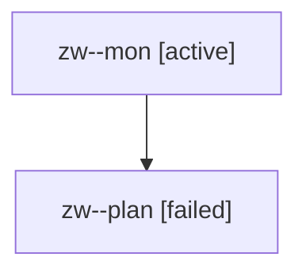

# Family: zw

[Agent Hoods](../README.md) / [bbugyi200](../users/bbugyi200/README.md) / [athena](../users/bbugyi200/machines/athena/README.md) / [zw](../users/bbugyi200/machines/athena/hoods/zw/README.md) / zw

Owner: `bbugyi200.athena` · Hood: `zw` · Members: 2

## Lineage

The diagram is an optional enhancement; the ordered table below contains the same lineage in accessible text.

| Role | Agent | State | Model / provider | Timing | Commits | Prompt | Chat |
|---|---|---|---|---|---:|---|---|
| mon | zw--mon | active | opus / claude | 2026-08-13T19:23:25.608493+00:00 | 0 | — | — |
| plan | zw--plan | failed | opus / claude | 2026-08-13T19:11:48.429241+00:00 | 0 | [Prompt](../agents/bbugyi200.athena.zw--plan/prompt.md) | [Chat](../agents/bbugyi200.athena.zw--plan/chat.md) |
