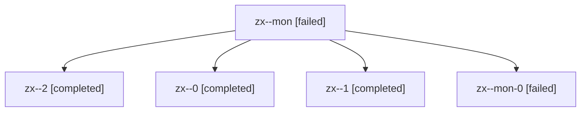

# Family: zx

[Agent Hoods](../README.md) / [bbugyi200](../users/bbugyi200/README.md) / [athena](../users/bbugyi200/machines/athena/README.md) / [zx](../users/bbugyi200/machines/athena/hoods/zx/README.md) / zx

Owner: `bbugyi200.athena` · Hood: `zx` · Members: 5

## Lineage

The diagram is an optional enhancement; the ordered table below contains the same lineage in accessible text.

| Role | Agent | State | Model / provider | Timing | Commits | Prompt | Chat |
|---|---|---|---|---|---:|---|---|
| mon | zx--mon | failed | opus / claude | 2026-08-13T19:42:31.203678+00:00 | 0 | — | [Chat](../agents/bbugyi200.athena.zx--mon/chat.md) |
| 2 | zx--2 | completed | opus / claude | 2026-08-13T20:03:37.997220+00:00 | 0 | [Prompt](../agents/bbugyi200.athena.zx--2/prompt.md) | [Chat](../agents/bbugyi200.athena.zx--2/chat.md) |
| 0 | zx--0 | completed | opus / claude | 2026-08-13T19:12:09.032135+00:00 | [1](../agents/bbugyi200.athena.zx--0/README.md#commits) | [Prompt](../agents/bbugyi200.athena.zx--0/prompt.md) | [Chat](../agents/bbugyi200.athena.zx--0/chat.md) |
| 1 | zx--1 | completed | opus / claude | 2026-08-13T19:44:41.112940+00:00 | 0 | [Prompt](../agents/bbugyi200.athena.zx--1/prompt.md) | [Chat](../agents/bbugyi200.athena.zx--1/chat.md) |
| mon-0 | zx--mon-0 | failed | opus / claude | 2026-08-13T19:50:10.072163+00:00 | 0 | — | [Chat](../agents/bbugyi200.athena.zx--mon-0/chat.md) |

## Commits

| Role | Repo | Commit | Subject | Committed |
|---|---|---|---|---|
| 0 | sase | [`31b9c62`](https://github.com/sase-org/sase/commit/31b9c62b6805caced5c554f2c5a51dfad64ecb10) | fix(tui): frame snippet panes without tinted fills | 2026-08-13 19:44:09 UTC |
