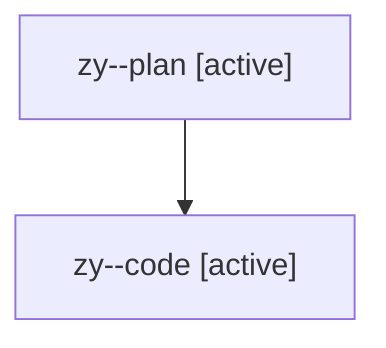

# Family: zy

[Agent Hoods](../README.md) / [bbugyi200](../users/bbugyi200/README.md) / [athena](../users/bbugyi200/machines/athena/README.md) / [zy](../users/bbugyi200/machines/athena/hoods/zy/README.md) / zy

Owner: `bbugyi200.athena` · Hood: `zy` · Members: 2

## Lineage

The diagram is an optional enhancement; the ordered table below contains the same lineage in accessible text.

| Role | Agent | State | Model / provider | Timing | Commits | Prompt | Chat |
|---|---|---|---|---|---:|---|---|
| plan | zy--plan | active | opus / claude | 2026-08-13T19:29:54.036789+00:00 | 0 | [Prompt](../agents/bbugyi200.athena.zy--plan/prompt.md) | [Chat](../agents/bbugyi200.athena.zy--plan/chat.md) |
| code | zy--code | active | sonnet / claude | 2026-08-13T20:07:10.386842+00:00 | 0 | — | — |
