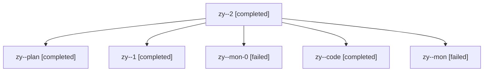

# Family: zy

[Agent Hoods](../README.md) / [bbugyi200](../users/bbugyi200/README.md) / [athena](../users/bbugyi200/machines/athena/README.md) / [zy](../users/bbugyi200/machines/athena/hoods/zy/README.md) / zy

Owner: `bbugyi200.athena` · Hood: `zy` · Members: 6

## Lineage

The diagram is an optional enhancement; the ordered table below contains the same lineage in accessible text.

| Role | Agent | State | Model / provider | Timing | Commits | Prompt | Chat |
|---|---|---|---|---|---:|---|---|
| 2 | zy--2 | completed | sonnet / claude | 2026-08-13T21:06:02.904304+00:00 | [1](../agents/bbugyi200.athena.zy--2/README.md#commits) | [Prompt](../agents/bbugyi200.athena.zy--2/prompt.md) | [Chat](../agents/bbugyi200.athena.zy--2/chat.md) |
| plan | zy--plan | completed | opus / claude | 2026-08-13T19:29:54.036789+00:00 | 0 | [Prompt](../agents/bbugyi200.athena.zy--plan/prompt.md) | [Chat](../agents/bbugyi200.athena.zy--plan/chat.md) |
| 1 | zy--1 | completed | sonnet / claude | 2026-08-13T20:53:20.704233+00:00 | 0 | [Prompt](../agents/bbugyi200.athena.zy--1/prompt.md) | [Chat](../agents/bbugyi200.athena.zy--1/chat.md) |
| mon-0 | zy--mon-0 | failed | sonnet / claude | 2026-08-13T20:55:18.730370+00:00 | 0 | — | [Chat](../agents/bbugyi200.athena.zy--mon-0/chat.md) |
| code | zy--code | completed | sonnet / claude | 2026-08-13T20:07:10.386842+00:00 | 0 | — | [Chat](../agents/bbugyi200.athena.zy--code/chat.md) |
| mon | zy--mon | failed | sonnet / claude | 2026-08-13T20:52:16.139007+00:00 | 0 | — | [Chat](../agents/bbugyi200.athena.zy--mon/chat.md) |

## Commits

| Role | Repo | Commit | Subject | Committed |
|---|---|---|---|---|
| 2 | sase | [`0083d1e`](https://github.com/sase-org/sase/commit/0083d1e10adaa7342fca7ee65b8ac4257b2fe034) | fix(ace): stop workspace-claim placeholder STARTING rows from becoming phantoms | 2026-08-13 17:12:54 EDT |
