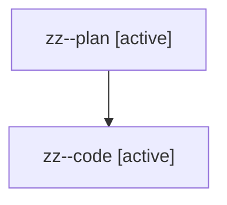

# Family: zz

[Agent Hoods](../README.md) / [bbugyi200](../users/bbugyi200/README.md) / [athena](../users/bbugyi200/machines/athena/README.md) / [zz](../users/bbugyi200/machines/athena/hoods/zz/README.md) / zz

Owner: `bbugyi200.athena` · Hood: `zz` · Members: 2

## Lineage

The diagram is an optional enhancement; the ordered table below contains the same lineage in accessible text.

| Role | Agent | State | Model / provider | Timing | Commits | Prompt | Chat |
|---|---|---|---|---|---:|---|---|
| plan | zz--plan | active | opus / claude | 2026-08-13T20:19:01.498613+00:00 | 0 | [Prompt](../agents/bbugyi200.athena.zz--plan/prompt.md) | [Chat](../agents/bbugyi200.athena.zz--plan/chat.md) |
| code | zz--code | active | sonnet / claude | 2026-08-13T20:25:34.528898+00:00 | 0 | — | — |
