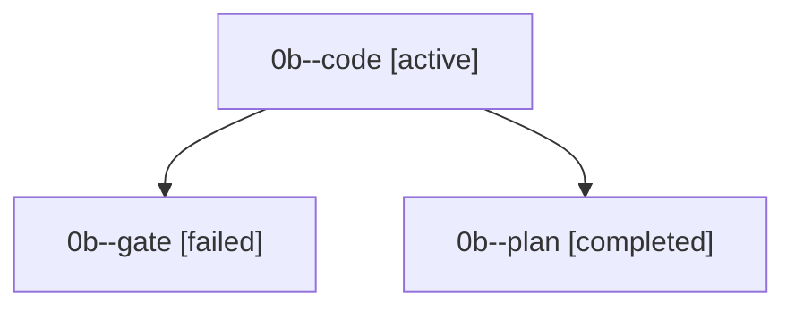

# Family: 0b

[Agent Hoods](../README.md) / [bbugyi200](../users/bbugyi200/README.md) / [kellys\_mbp](../users/bbugyi200/machines/kellys_mbp/README.md) / [0b](../users/bbugyi200/machines/kellys_mbp/hoods/0b/README.md) / 0b

Owner: `bbugyi200.kellys_mbp` · Hood: `0b` · Members: 3

## Lineage

The diagram is an optional enhancement; the ordered table below contains the same lineage in accessible text.

| Role | Agent | State | Model / provider | Timing | Commits | Prompt | Chat |
|---|---|---|---|---|---:|---|---|
| code | 0b--code | active | gpt-5.5 / codex | 2026-09-12T19:20:05.233664+00:00 | [1](../agents/bbugyi200.kellys_mbp.0b--code/README.md#commits) | [Prompt](../agents/bbugyi200.kellys_mbp.0b--code/prompt.md) | — |
| gate | 0b--gate | failed | opus / claude | 2026-09-12T19:19:44.332806+00:00 → 2026-09-12T19:20:02.365492+00:00 | 0 | — | [Chat](../agents/bbugyi200.kellys_mbp.0b--gate/chat.md) |
| plan | 0b--plan | completed | opus / claude | 2026-09-12T19:09:53.856322+00:00 → 2026-09-12T19:19:24.993694+00:00 | 0 | [Prompt](../agents/bbugyi200.kellys_mbp.0b--plan/prompt.md) | [Chat](../agents/bbugyi200.kellys_mbp.0b--plan/chat.md) |

## Commits

| Role | Repo | Commit | Subject | Committed |
|---|---|---|---|---|
| — | sase | [`4c1c10b`](https://github.com/sase-org/sase/commit/4c1c10be6693ebccdea09b0ac0202cec207efa2e) | chore: Add SDD prompt and plan for remove\_agent\_details\_header | 2026-06-02 18:42:32 EDT |
| — | sase | [`225648c`](https://github.com/sase-org/sase/commit/225648cd81ed4b6227ed68ab1dbd1613609589be) | fix: remove agents tab details header | 2026-06-02 18:47:20 EDT |
| — | sase | [`6b7b3e9`](https://github.com/sase-org/sase/commit/6b7b3e98102d45762a2ce94160b69f553616e742) | docs(research): critique dynamic agent families project note | 2026-07-05 18:58:18 EDT |
| — | sase | [`bfabe37`](https://github.com/sase-org/sase/commit/bfabe3728fa715fb1e1c843decec696ac67926a8) | feat(demos): add multi-runtime ACE fan-out demo | 2026-07-07 02:06:58 EDT |
| code | sase | [`2170f42`](https://github.com/sase-org/sase/commit/2170f422e938d1e15cba5aa2002d4adca8cbb505) | feat(xprompt): flag retired directive syntax in doctor | 2026-09-13 06:37:09 EDT |

## Neighbors

| Agent | Relation | State |
|---|---|---|
| [0b.f1](../agents/bbugyi200.kellys_mbp.0b.f1/README.md) | descendant | completed |
| [0b.f1.f1](../agents/bbugyi200.kellys_mbp.0b.f1.f1/README.md) | descendant | completed |
