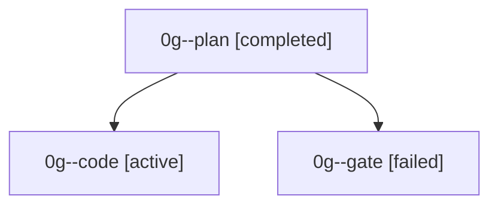

# Family: 0g

[Agent Hoods](../README.md) / [bbugyi200](../users/bbugyi200/README.md) / [kellys\_mbp](../users/bbugyi200/machines/kellys_mbp/README.md) / [0g](../users/bbugyi200/machines/kellys_mbp/hoods/0g/README.md) / 0g

Owner: `bbugyi200.kellys_mbp` · Hood: `0g` · Members: 3

## Lineage

The diagram is an optional enhancement; the ordered table below contains the same lineage in accessible text.

| Role | Agent | State | Model / provider | Timing | Commits | Prompt | Chat |
|---|---|---|---|---|---:|---|---|
| plan | 0g--plan | completed | claude-fable-5 / claude | 2026-09-13T22:17:53.327025+00:00 → 2026-09-13T22:26:13.843873+00:00 | 0 | [Prompt](../agents/bbugyi200.kellys_mbp.0g--plan/prompt.md) | [Chat](../agents/bbugyi200.kellys_mbp.0g--plan/chat.md) |
| code | 0g--code | active | gpt-5.5 / codex | 2026-09-13T22:30:41.122696+00:00 | [1](../agents/bbugyi200.kellys_mbp.0g--code/README.md#commits) | [Prompt](../agents/bbugyi200.kellys_mbp.0g--code/prompt.md) | — |
| gate | 0g--gate | failed | claude-fable-5 / claude | 2026-09-13T22:30:21.313885+00:00 → 2026-09-13T22:30:38.539921+00:00 | 0 | — | [Chat](../agents/bbugyi200.kellys_mbp.0g--gate/chat.md) |

## Commits

| Role | Repo | Commit | Subject | Committed |
|---|---|---|---|---|
| — | sase | [`d9b44c7`](https://github.com/sase-org/sase/commit/d9b44c70d887fe96d755464748b73ed57219f5c0) | chore: Add SDD prompt and plan for slow\_tool\_calls\_start\_time\_ordering | 2026-07-05 22:46:32 EDT |
| — | sase | [`5f29a7f`](https://github.com/sase-org/sase/commit/5f29a7fddcf5afdb0ed24afc4b88fe59ec786530) | fix: order slow tool calls by start time | 2026-07-05 23:13:15 EDT |
| code | sase | [`e57d76c`](https://github.com/sase-org/sase/commit/e57d76c79bf2184cd463520c0e0dc19c6fe2e82e) | fix(repo): resolve display-named repo opens | 2026-09-13 19:46:02 EDT |
