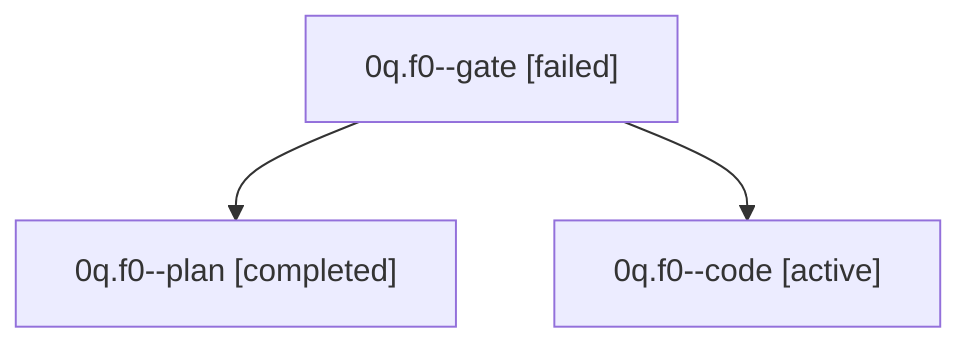

# Family: 0q.f0

[Agent Hoods](../README.md) / [bbugyi200](../users/bbugyi200/README.md) / [kellys\_mbp](../users/bbugyi200/machines/kellys_mbp/README.md) / [0q](../users/bbugyi200/machines/kellys_mbp/hoods/0q/README.md) / 0q.f0

Owner: `bbugyi200.kellys_mbp` · Hood: `0q` · Members: 3

## Lineage

The diagram is an optional enhancement; the ordered table below contains the same lineage in accessible text.

| Role | Agent | State | Model / provider | Timing | Commits | Prompt | Chat |
|---|---|---|---|---|---:|---|---|
| gate | 0q.f0--gate | failed | gpt-5.6-sol / codex | 2026-09-15T16:05:02.276739+00:00 → 2026-09-15T16:05:19.936532+00:00 | 0 | — | [Chat](../agents/bbugyi200.kellys_mbp.0q.f0--gate/chat.md) |
| plan | 0q.f0--plan | completed | gpt-5.6-sol / codex | 2026-09-15T15:14:24.486318+00:00 → 2026-09-15T15:20:11.062411+00:00 | 0 | [Prompt](../agents/bbugyi200.kellys_mbp.0q.f0--plan/prompt.md) | [Chat](../agents/bbugyi200.kellys_mbp.0q.f0--plan/chat.md) |
| code | 0q.f0--code | active | gpt-5.5 / codex | 2026-09-15T16:05:22.710752+00:00 | 0 | [Prompt](../agents/bbugyi200.kellys_mbp.0q.f0--code/prompt.md) | — |

## Neighbors

| Agent | Relation | State |
|---|---|---|
| [0q](../agents/bbugyi200.kellys_mbp.0q/README.md) | ancestor | completed |
