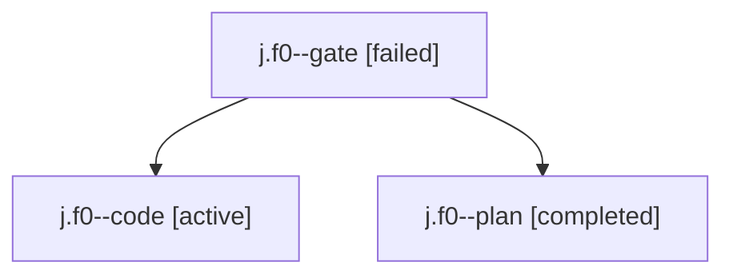

# Family: j.f0

[Agent Hoods](../README.md) / [bbugyi200](../users/bbugyi200/README.md) / [kellys\_mbp](../users/bbugyi200/machines/kellys_mbp/README.md) / [j](../users/bbugyi200/machines/kellys_mbp/hoods/j/README.md) / j.f0

Owner: `bbugyi200.kellys_mbp` · Hood: `j` · Members: 3

## Lineage

The diagram is an optional enhancement; the ordered table below contains the same lineage in accessible text.

| Role | Agent | State | Model / provider | Timing | Commits | Prompt | Chat |
|---|---|---|---|---|---:|---|---|
| gate | j.f0--gate | failed | claude-fable-5 / claude | 2026-09-03T19:13:09.019803+00:00 → 2026-09-03T19:43:29.098312+00:00 | 0 | — | [Chat](../agents/bbugyi200.kellys_mbp.j.f0--gate/chat.md) |
| code | j.f0--code | active | grok-4.6 / grok | 2026-09-03T19:43:31.121690+00:00 | [1](../agents/bbugyi200.kellys_mbp.j.f0--code/README.md#commits) | [Prompt](../agents/bbugyi200.kellys_mbp.j.f0--code/prompt.md) | — |
| plan | j.f0--plan | completed | claude-fable-5 / claude | 2026-09-03T18:57:06.511756+00:00 → 2026-09-03T19:13:18.808574+00:00 | 0 | [Prompt](../agents/bbugyi200.kellys_mbp.j.f0--plan/prompt.md) | [Chat](../agents/bbugyi200.kellys_mbp.j.f0--plan/chat.md) |

## Commits

| Role | Repo | Commit | Subject | Committed |
|---|---|---|---|---|
| code | sase | [`ad1da7f`](https://github.com/sase-org/sase/commit/ad1da7fc2bcb564924eda094ffa7353396103d57) | fix(finalizers): rescue stitch timeouts after the commit already landed | 2026-09-03 16:42:55 EDT |

## Neighbors

| Agent | Relation | State |
|---|---|---|
| [j](../agents/bbugyi200.kellys_mbp.j/README.md) | ancestor | dismissed |
| [j.f1](../agents/bbugyi200.kellys_mbp.j.f1/README.md) | j hood | completed |
