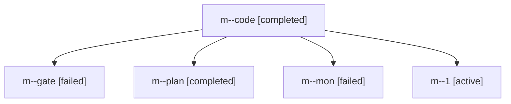

# Family: m

[Agent Hoods](../README.md) / [bbugyi200](../users/bbugyi200/README.md) / [kellys\_mbp](../users/bbugyi200/machines/kellys_mbp/README.md) / [m](../users/bbugyi200/machines/kellys_mbp/hoods/m/README.md) / m

Owner: `bbugyi200.kellys_mbp` · Hood: `m` · Members: 5

## Lineage

The diagram is an optional enhancement; the ordered table below contains the same lineage in accessible text.

| Role | Agent | State | Model / provider | Timing | Commits | Prompt | Chat |
|---|---|---|---|---|---:|---|---|
| code | m--code | completed | grok-4.6 / grok | 2026-09-04T09:22:09.021424+00:00 → 2026-09-04T10:03:54.280646+00:00 | 0 | [Prompt](../agents/bbugyi200.kellys_mbp.m--code/prompt.md) | [Chat](../agents/bbugyi200.kellys_mbp.m--code/chat.md) |
| gate | m--gate | failed | claude-fable-5 / claude | 2026-09-03T21:56:36.297841+00:00 → 2026-09-04T09:22:06.047980+00:00 | 0 | — | [Chat](../agents/bbugyi200.kellys_mbp.m--gate/chat.md) |
| plan | m--plan | completed | claude-fable-5 / claude | 2026-09-03T21:40:49.903136+00:00 → 2026-09-03T21:56:47.709591+00:00 | 0 | [Prompt](../agents/bbugyi200.kellys_mbp.m--plan/prompt.md) | [Chat](../agents/bbugyi200.kellys_mbp.m--plan/chat.md) |
| mon | m--mon | failed | grok-4.6 / grok | 2026-09-04T10:03:45.144728+00:00 → 2026-09-04T10:06:47.545952+00:00 | 0 | — | [Chat](../agents/bbugyi200.kellys_mbp.m--mon/chat.md) |
| 1 | m--1 | active | grok-4.6 / grok | 2026-09-04T10:06:50.788175+00:00 | [1](../agents/bbugyi200.kellys_mbp.m--1/README.md#commits) | [Prompt](../agents/bbugyi200.kellys_mbp.m--1/prompt.md) | — |

## Commits

| Role | Repo | Commit | Subject | Committed |
|---|---|---|---|---|
| — | sase | [`415ff51`](https://github.com/sase-org/sase/commit/415ff51766ff8ad65b66b139872f3793126431b0) | chore: Add SDD prompt and plan for telegram\_project\_display\_names | 2026-07-06 15:52:30 EDT |
| 1 | sase | [`b8f62f1`](https://github.com/sase-org/sase/commit/b8f62f182d66656b62219041907ac2d16278df33) | fix(sdd): memoize artifact-link rename repair and honor chop deadline | 2026-09-04 06:12:36 EDT |
