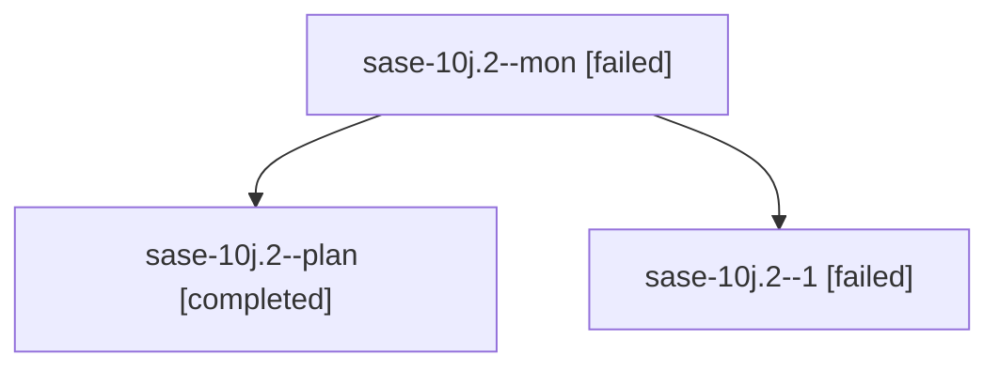

# Family: sase-10j.2

[Agent Hoods](../README.md) / [bbugyi200](../users/bbugyi200/README.md) / [kellys\_mbp](../users/bbugyi200/machines/kellys_mbp/README.md) / [sase-10j](../users/bbugyi200/machines/kellys_mbp/hoods/sase-10j/README.md) / sase-10j.2

Owner: `bbugyi200.kellys_mbp` · Hood: `sase-10j` · Members: 3 · Bead: [sase-10j.2](https://github.com/sase-org/sase--beads/blob/main/pages/sase-10j/sase-10j.2.md)

## Lineage

The diagram is an optional enhancement; the ordered table below contains the same lineage in accessible text.

| Role | Agent | State | Model / provider | Timing | Commits | Prompt | Chat |
|---|---|---|---|---|---:|---|---|
| mon | sase-10j.2--mon | failed | sonnet / claude | 2026-09-14T02:37:10.526183+00:00 → 2026-09-14T03:01:55.932209+00:00 | 0 | — | [Chat](../agents/bbugyi200.kellys_mbp.sase-10j.2--mon/chat.md) |
| plan | sase-10j.2--plan | completed | sonnet / claude | 2026-09-14T01:58:21.055819+00:00 → 2026-09-14T02:37:21.571887+00:00 | 0 | [Prompt](../agents/bbugyi200.kellys_mbp.sase-10j.2--plan/prompt.md) | [Chat](../agents/bbugyi200.kellys_mbp.sase-10j.2--plan/chat.md) |
| 1 | sase-10j.2--1 | failed | sonnet / claude | 20260913230155 → 2026-09-14T03:02:02.492410+00:00 | 0 | [Prompt](../agents/bbugyi200.kellys_mbp.sase-10j.2--1/prompt.md) | — |

## Neighbors

| Agent | Relation | State |
|---|---|---|
| [sase-10j.1](../agents/bbugyi200.kellys_mbp.sase-10j.1/README.md) | sase-10j hood | active |
| [sase-10j.land](../agents/bbugyi200.kellys_mbp.sase-10j.land/README.md) | sase-10j hood | waiting |
