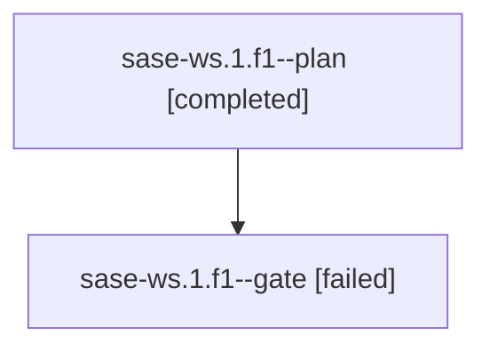

# Family: sase-ws.1.f1

[Agent Hoods](../README.md) / [bbugyi200](../users/bbugyi200/README.md) / [kellys\_mbp](../users/bbugyi200/machines/kellys_mbp/README.md) / [sase-ws](../users/bbugyi200/machines/kellys_mbp/hoods/sase-ws/README.md) / sase-ws.1.f1

Owner: `bbugyi200.kellys_mbp` · Hood: `sase-ws` · Members: 2

## Lineage

The diagram is an optional enhancement; the ordered table below contains the same lineage in accessible text.

| Role | Agent | State | Model / provider | Timing | Commits | Prompt | Chat |
|---|---|---|---|---|---:|---|---|
| plan | sase-ws.1.f1--plan | completed | claude-fable-5 / claude | 2026-09-04T19:15:49.823605+00:00 → 2026-09-04T19:24:31.486817+00:00 | 0 | [Prompt](../agents/bbugyi200.kellys_mbp.sase-ws.1.f1--plan/prompt.md) | [Chat](../agents/bbugyi200.kellys_mbp.sase-ws.1.f1--plan/chat.md) |
| gate | sase-ws.1.f1--gate | failed | claude-fable-5 / claude | 2026-09-04T19:24:15.962732+00:00 → 2026-09-05T10:06:42.484699+00:00 | 0 | — | [Chat](../agents/bbugyi200.kellys_mbp.sase-ws.1.f1--gate/chat.md) |

## Neighbors

| Agent | Relation | State |
|---|---|---|
| [sase-ws.1](bbugyi200.kellys_mbp.sase-ws.1.md) (family · 3) | ancestor | active 1, dismissed 2 |
| [sase-ws.1.f0](../agents/bbugyi200.kellys_mbp.sase-ws.1.f0/README.md) | sase-ws.1 hood | dismissed |
| [sase-ws.2](../agents/bbugyi200.kellys_mbp.sase-ws.2/README.md) | sase-ws hood | active |
| [sase-ws.3](../agents/bbugyi200.kellys_mbp.sase-ws.3/README.md) | sase-ws hood | dismissed |
| [sase-ws.4](../agents/bbugyi200.kellys_mbp.sase-ws.4/README.md) | sase-ws hood | dismissed |
| [sase-ws.5](../agents/bbugyi200.kellys_mbp.sase-ws.5/README.md) | sase-ws hood | dismissed |
| [sase-ws.6](../agents/bbugyi200.kellys_mbp.sase-ws.6/README.md) | sase-ws hood | dismissed |
| [sase-ws.land](../agents/bbugyi200.kellys_mbp.sase-ws.land/README.md) | sase-ws hood | dismissed |
