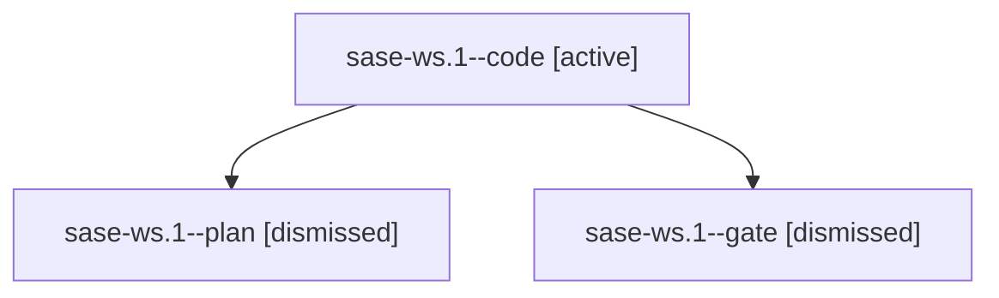

# Family: sase-ws.1

[Agent Hoods](../README.md) / [bbugyi200](../users/bbugyi200/README.md) / [kellys\_mbp](../users/bbugyi200/machines/kellys_mbp/README.md) / [sase-ws](../users/bbugyi200/machines/kellys_mbp/hoods/sase-ws/README.md) / sase-ws.1

Owner: `bbugyi200.kellys_mbp` · Hood: `sase-ws` · Members: 3 · Bead: [sase-ws.1](https://github.com/sase-org/sase--beads/blob/main/pages/sase-ws/sase-ws.1.md)

## Lineage

The diagram is an optional enhancement; the ordered table below contains the same lineage in accessible text.

| Role | Agent | State | Model / provider | Timing | Commits | Prompt | Chat |
|---|---|---|---|---|---:|---|---|
| code | sase-ws.1--code | active | grok-4.6 / grok | 2026-09-04T18:19:22.978254+00:00 | 0 | — | — |
| plan | sase-ws.1--plan | dismissed | gpt-5.6-sol / codex | 2026-09-04T14:06:49.165283 → 2026-09-04T14:56:52.691821 | 0 | [Prompt](../agents/bbugyi200.kellys_mbp.sase-ws.1--plan/prompt.md) | — |
| gate | sase-ws.1--gate | dismissed | gpt-5.6-sol / codex | 2026-09-04T14:16:44.326478 → 2026-09-04T14:17:03 | 0 | — | — |

## Neighbors

| Agent | Relation | State |
|---|---|---|
| [sase-ws.1.f0](../agents/bbugyi200.kellys_mbp.sase-ws.1.f0/README.md) | descendant | dismissed |
| [sase-ws.1.f1](bbugyi200.kellys_mbp.sase-ws.1.f1.md) (family · 2) | descendant | completed 1, failed 1 |
| [sase-ws.2](../agents/bbugyi200.kellys_mbp.sase-ws.2/README.md) | sase-ws hood | active |
| [sase-ws.3](../agents/bbugyi200.kellys_mbp.sase-ws.3/README.md) | sase-ws hood | dismissed |
| [sase-ws.4](../agents/bbugyi200.kellys_mbp.sase-ws.4/README.md) | sase-ws hood | dismissed |
| [sase-ws.5](../agents/bbugyi200.kellys_mbp.sase-ws.5/README.md) | sase-ws hood | dismissed |
| [sase-ws.6](../agents/bbugyi200.kellys_mbp.sase-ws.6/README.md) | sase-ws hood | dismissed |
| [sase-ws.land](../agents/bbugyi200.kellys_mbp.sase-ws.land/README.md) | sase-ws hood | dismissed |
