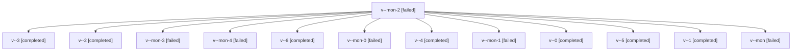

# Family: v

[Agent Hoods](../README.md) / [bbugyi200](../users/bbugyi200/README.md) / [kellys\_mbp](../users/bbugyi200/machines/kellys_mbp/README.md) / [v](../users/bbugyi200/machines/kellys_mbp/hoods/v/README.md) / v

Owner: `bbugyi200.kellys_mbp` · Hood: `v` · Members: 13

## Lineage

The diagram is an optional enhancement; the ordered table below contains the same lineage in accessible text.

| Role | Agent | State | Model / provider | Timing | Commits | Prompt | Chat |
|---|---|---|---|---|---:|---|---|
| mon-2 | v--mon-2 | failed | grok-4.6 / grok | 2026-09-04T18:43:25.634360+00:00 → 2026-09-04T18:47:40.953259+00:00 | 0 | — | [Chat](../agents/bbugyi200.kellys_mbp.v--mon-2/chat.md) |
| 3 | v--3 | completed | grok-4.6 / grok | 2026-09-04T18:31:45.388967+00:00 → 2026-09-04T18:43:38.211708+00:00 | 0 | [Prompt](../agents/bbugyi200.kellys_mbp.v--3/prompt.md) | [Chat](../agents/bbugyi200.kellys_mbp.v--3/chat.md) |
| 2 | v--2 | completed | grok-4.6 / grok | 2026-09-04T18:16:54.881482+00:00 → 2026-09-04T18:23:25.609144+00:00 | 0 | [Prompt](../agents/bbugyi200.kellys_mbp.v--2/prompt.md) | [Chat](../agents/bbugyi200.kellys_mbp.v--2/chat.md) |
| mon-3 | v--mon-3 | failed | grok-4.6 / grok | 2026-09-04T18:58:56.395867+00:00 → 2026-09-04T19:28:13.928101+00:00 | 0 | — | [Chat](../agents/bbugyi200.kellys_mbp.v--mon-3/chat.md) |
| mon-4 | v--mon-4 | failed | grok-4.6 / grok | 2026-09-04T20:02:34.664404+00:00 → 2026-09-04T20:47:57.324035+00:00 | 0 | — | [Chat](../agents/bbugyi200.kellys_mbp.v--mon-4/chat.md) |
| 6 | v--6 | completed | grok-4.6 / grok | 2026-09-04T20:51:26.292886+00:00 → 2026-09-04T21:58:38.970206+00:00 | 0 | [Prompt](../agents/bbugyi200.kellys_mbp.v--6/prompt.md) | [Chat](../agents/bbugyi200.kellys_mbp.v--6/chat.md) |
| mon-0 | v--mon-0 | failed | grok-4.6 / grok | 2026-09-04T18:07:54.885177+00:00 → 2026-09-04T18:14:20.743624+00:00 | 0 | — | [Chat](../agents/bbugyi200.kellys_mbp.v--mon-0/chat.md) |
| 4 | v--4 | completed | grok-4.6 / grok | 2026-09-04T18:50:17.072725+00:00 → 2026-09-04T18:59:10.775853+00:00 | 0 | [Prompt](../agents/bbugyi200.kellys_mbp.v--4/prompt.md) | [Chat](../agents/bbugyi200.kellys_mbp.v--4/chat.md) |
| mon-1 | v--mon-1 | failed | grok-4.6 / grok | 2026-09-04T18:23:13.481904+00:00 → 2026-09-04T18:28:51.517132+00:00 | 0 | — | [Chat](../agents/bbugyi200.kellys_mbp.v--mon-1/chat.md) |
| 0 | v--0 | completed | grok-4.6 / grok | 2026-09-04T16:59:54.476779+00:00 → 2026-09-04T17:43:54.048925+00:00 | 0 | [Prompt](../agents/bbugyi200.kellys_mbp.v--0/prompt.md) | [Chat](../agents/bbugyi200.kellys_mbp.v--0/chat.md) |
| 5 | v--5 | completed | grok-4.6 / grok | 2026-09-04T19:30:28.489839+00:00 → 2026-09-04T20:02:48.002375+00:00 | 0 | [Prompt](../agents/bbugyi200.kellys_mbp.v--5/prompt.md) | [Chat](../agents/bbugyi200.kellys_mbp.v--5/chat.md) |
| 1 | v--1 | completed | grok-4.6 / grok | 2026-09-04T17:59:57.893211+00:00 → 2026-09-04T18:08:05.973959+00:00 | 0 | [Prompt](../agents/bbugyi200.kellys_mbp.v--1/prompt.md) | [Chat](../agents/bbugyi200.kellys_mbp.v--1/chat.md) |
| mon | v--mon | failed | grok-4.6 / grok | 2026-09-04T17:43:39.509128+00:00 → 2026-09-04T17:58:11.475780+00:00 | 0 | — | [Chat](../agents/bbugyi200.kellys_mbp.v--mon/chat.md) |

## Commits

| Role | Repo | Commit | Subject | Committed |
|---|---|---|---|---|
| — | sase | [`d2ac8c3`](https://github.com/sase-org/sase/commit/d2ac8c317cf07e2691e958b972761f2f1e31d5c6) | chore: Add SDD prompt and plan for telegram\_enabled\_gate | 2026-07-03 14:03:03 EDT |
| — | sase | [`f48e881`](https://github.com/sase-org/sase/commit/f48e8818e340a6404b9d8c7c2f381b1072c67c4f) | chore: Add SDD prompt and plan for nested\_agent\_docs\_provider\_shims | 2026-07-06 19:31:49 EDT |
| — | sase | [`17acd9f`](https://github.com/sase-org/sase/commit/17acd9fec688aa5995fc9f636dc4e9ab2b43a278) | fix: manage nested agent doc provider shims | 2026-07-06 19:41:47 EDT |
| — | sase | [`5fc41b3`](https://github.com/sase-org/sase/commit/5fc41b3cba1f0ef547831556e953d4764a4540f6) | fix(agent): skip empty identity fields in family attach | 2026-09-04 17:54:43 EDT |
