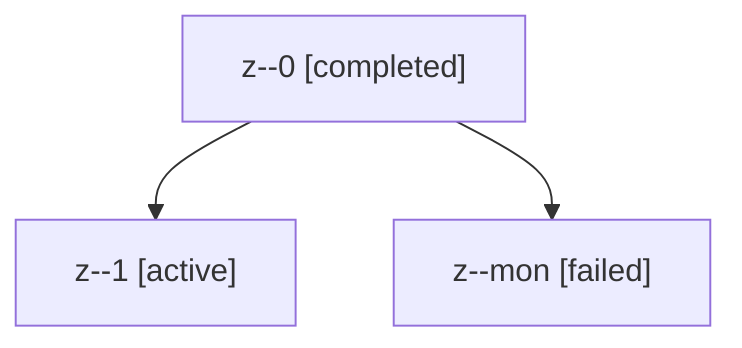

# Family: z

[Agent Hoods](../README.md) / [bbugyi200](../users/bbugyi200/README.md) / [kellys\_mbp](../users/bbugyi200/machines/kellys_mbp/README.md) / [z](../users/bbugyi200/machines/kellys_mbp/hoods/z/README.md) / z

Owner: `bbugyi200.kellys_mbp` · Hood: `z` · Members: 3

## Lineage

The diagram is an optional enhancement; the ordered table below contains the same lineage in accessible text.

| Role | Agent | State | Model / provider | Timing | Commits | Prompt | Chat |
|---|---|---|---|---|---:|---|---|
| 0 | z--0 | completed | sonnet / claude | 2026-09-05T14:13:29.074965+00:00 → 2026-09-05T14:27:11.463730+00:00 | 0 | [Prompt](../agents/bbugyi200.kellys_mbp.z--0/prompt.md) | [Chat](../agents/bbugyi200.kellys_mbp.z--0/chat.md) |
| 1 | z--1 | active | gpt-5.5 / codex | 2026-09-05T14:59:09.214261+00:00 | [1](../agents/bbugyi200.kellys_mbp.z--1/README.md#commits) | [Prompt](../agents/bbugyi200.kellys_mbp.z--1/prompt.md) | — |
| mon | z--mon | failed | sonnet / claude | 2026-09-05T14:27:00.975695+00:00 → 2026-09-05T14:57:50.070553+00:00 | 0 | — | [Chat](../agents/bbugyi200.kellys_mbp.z--mon/chat.md) |

## Commits

| Role | Repo | Commit | Subject | Committed |
|---|---|---|---|---|
| — | sase | [`76067eb`](https://github.com/sase-org/sase/commit/76067eb3e564bf85fb4964b21ace987aaeb002be) | fix: stabilize CLI rendering and git preallocation | 2026-07-06 22:44:00 EDT |
| 1 | sase | [`bc9f1dd`](https://github.com/sase-org/sase/commit/bc9f1dd756ce5471481cc3bbd0ad1f78eacf181e) | fix(grok): retry max token truncation errors | 2026-09-05 11:05:13 EDT |
