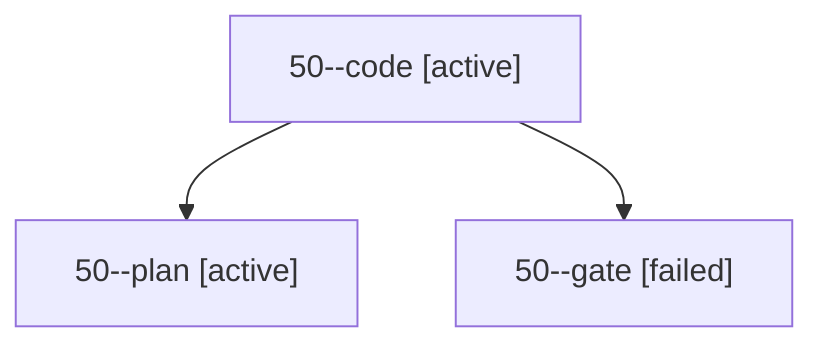

# Session: 50

[Agent Hoods](../README.md) / [bbugyi200](../users/bbugyi200/README.md) / [apollo](../users/bbugyi200/machines/apollo/README.md) / [50](../users/bbugyi200/machines/apollo/hoods/50/README.md) / 50

Owner: `bbugyi200.apollo` · Hood: `50` · Members: 3

## Lineage

The diagram is an optional enhancement; the ordered table below contains the same lineage in accessible text.

| Role | Agent | State | Model / provider | Timing | Commits | Prompt | Chat |
|---|---|---|---|---|---:|---|---|
| code | 50--code | active | grok-4.6 / grok | 2026-10-04T12:38:51.476205+00:00 | 0 | — | — |
| plan | 50--plan | active | opus / claude | 2026-10-04T12:28:36.029418+00:00 | 0 | [Prompt](../agents/bbugyi200.apollo.50--plan/prompt.md) | [Chat](../agents/bbugyi200.apollo.50--plan/chat.md) |
| gate | 50--gate | failed | opus / claude | 2026-10-04T12:38:21.630241+00:00 → 2026-10-04T12:38:36.392270+00:00 | 0 | — | [Chat](../agents/bbugyi200.apollo.50--gate/chat.md) |

## Commits

| Role | Repo | Commit | Subject | Committed |
|---|---|---|---|---|
| — | sase | [`25a0d1a`](https://github.com/sase-org/sase/commit/25a0d1ae357c9ae39773d9b6d88784b6e8c3e15d) | chore: Add SDD prompt and plan for single\_count\_notification\_indicator | 2026-06-10 09:04:14 EDT |
| — | sase | [`91755ca`](https://github.com/sase-org/sase/commit/91755ca46b23847d12a87b149f6194e823773b4d) | feat: show single count in notification indicator | 2026-06-10 09:20:13 EDT |
