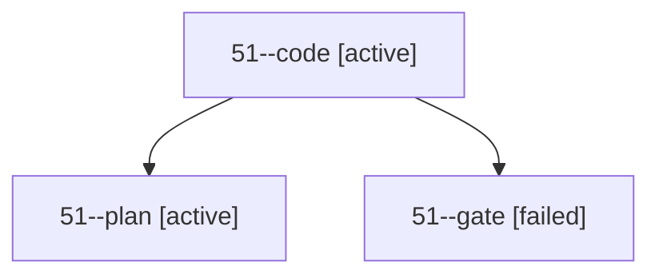

# Session: 51

[Agent Hoods](../README.md) / [bbugyi200](../users/bbugyi200/README.md) / [apollo](../users/bbugyi200/machines/apollo/README.md) / [51](../users/bbugyi200/machines/apollo/hoods/51/README.md) / 51

Owner: `bbugyi200.apollo` · Hood: `51` · Members: 3

## Lineage

The diagram is an optional enhancement; the ordered table below contains the same lineage in accessible text.

| Role | Agent | State | Model / provider | Timing | Commits | Prompt | Chat |
|---|---|---|---|---|---:|---|---|
| code | 51--code | active | gpt-6-luna / codex | 2026-10-04T14:01:01.817644+00:00 | 0 | — | — |
| plan | 51--plan | active | opus / claude | 2026-10-04T13:49:26.702974+00:00 | 0 | [Prompt](../agents/bbugyi200.apollo.51--plan/prompt.md) | [Chat](../agents/bbugyi200.apollo.51--plan/chat.md) |
| gate | 51--gate | failed | opus / claude | 2026-10-04T14:00:17.450797+00:00 → 2026-10-04T14:00:33.601841+00:00 | 0 | — | [Chat](../agents/bbugyi200.apollo.51--gate/chat.md) |

## Commits

| Role | Repo | Commit | Subject | Committed |
|---|---|---|---|---|
| — | sase | [`86e9ef0`](https://github.com/sase-org/sase/commit/86e9ef0e706125afdcf0674701e76c70ba124847) | chore: Add SDD prompt and plan for tui\_perf\_memory\_migration | 2026-06-10 09:04:22 EDT |
| — | sase | [`20d1294`](https://github.com/sase-org/sase/commit/20d129453f68a9b6070d1f6464817cfbf9313df9) | chore: migrate tui\_jk\_baseline memory to tui\_perf | 2026-06-10 09:11:41 EDT |

## Neighbors

| Agent | Relation | State |
|---|---|---|
| [51.f1](../agents/bbugyi200.apollo.51.f1/README.md) | descendant | completed |
