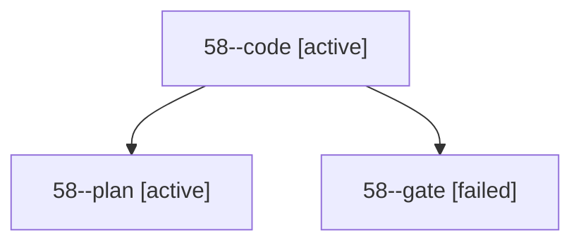

# Session: 58

[Agent Hoods](../README.md) / [bbugyi200](../users/bbugyi200/README.md) / [apollo](../users/bbugyi200/machines/apollo/README.md) / [58](../users/bbugyi200/machines/apollo/hoods/58/README.md) / 58

Owner: `bbugyi200.apollo` · Hood: `58` · Members: 3

## Lineage

The diagram is an optional enhancement; the ordered table below contains the same lineage in accessible text.

| Role | Agent | State | Model / provider | Timing | Commits | Prompt | Chat |
|---|---|---|---|---|---:|---|---|
| code | 58--code | active | muse-spark-1.3-contributor / muse | 2026-10-05T16:03:16.327533+00:00 | 0 | — | — |
| plan | 58--plan | active | gpt-6-astra / codex | 2026-10-05T15:57:54.415460+00:00 | 0 | [Prompt](../agents/bbugyi200.apollo.58--plan/prompt.md) | [Chat](../agents/bbugyi200.apollo.58--plan/chat.md) |
| gate | 58--gate | failed | gpt-6-astra / codex | 2026-10-05T16:02:48.809566+00:00 → 2026-10-05T16:02:59.526537+00:00 | 0 | — | [Chat](../agents/bbugyi200.apollo.58--gate/chat.md) |

## Commits

| Role | Repo | Commit | Subject | Committed |
|---|---|---|---|---|
| — | sase | [`78e0676`](https://github.com/sase-org/sase/commit/78e0676ad36e1b7266d3495df9ce99a751764ae0) | feat(init): initialize all active projects | 2026-07-10 19:46:15 EDT |
