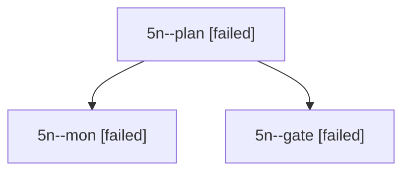

# Session: 5n

[Agent Hoods](../README.md) / [bbugyi200](../users/bbugyi200/README.md) / [apollo](../users/bbugyi200/machines/apollo/README.md) / [5n](../users/bbugyi200/machines/apollo/hoods/5n/README.md) / 5n

Owner: `bbugyi200.apollo` · Hood: `5n` · Members: 3

## Lineage

The diagram is an optional enhancement; the ordered table below contains the same lineage in accessible text.

| Role | Agent | State | Model / provider | Timing | Commits | Prompt | Chat |
|---|---|---|---|---|---:|---|---|
| plan | 5n--plan | failed | opus / claude | 2026-10-07T21:49:21.274850+00:00 → 2026-10-07T22:48:21.028826+00:00 | 0 | [Prompt](../agents/bbugyi200.apollo.5n--plan/prompt.md) | [Chat](../agents/bbugyi200.apollo.5n--plan/chat.md) |
| mon | 5n--mon | failed | opus / claude | 2026-10-07T22:48:04.503063+00:00 → 2026-10-07T22:49:35.258492+00:00 | 0 | — | [Chat](../agents/bbugyi200.apollo.5n--mon/chat.md) |
| gate | 5n--gate | failed | opus / claude | 2026-10-07T22:47:55.744418+00:00 → 2026-10-07T22:48:05.114705+00:00 | 0 | — | [Chat](../agents/bbugyi200.apollo.5n--gate/chat.md) |
