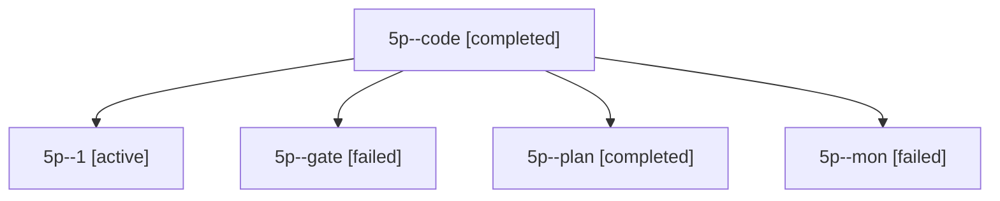

# Session: 5p

[Agent Hoods](../README.md) / [bbugyi200](../users/bbugyi200/README.md) / [apollo](../users/bbugyi200/machines/apollo/README.md) / [5p](../users/bbugyi200/machines/apollo/hoods/5p/README.md) / 5p

Owner: `bbugyi200.apollo` · Hood: `5p` · Members: 5

## Lineage

The diagram is an optional enhancement; the ordered table below contains the same lineage in accessible text.

| Role | Agent | State | Model / provider | Timing | Commits | Prompt | Chat |
|---|---|---|---|---|---:|---|---|
| code | 5p--code | completed | muse-spark-1.3-contributor / muse | 2026-10-07T22:32:17.407420+00:00 → 2026-10-07T22:38:35.118148+00:00 | 0 | — | [Chat](../agents/bbugyi200.apollo.5p--code/chat.md) |
| 1 | 5p--1 | active | muse-spark-1.3-contributor / muse | 2026-10-07T23:07:06.355264+00:00 | [1](../agents/bbugyi200.apollo.5p--1/README.md#commits) | [Prompt](../agents/bbugyi200.apollo.5p--1/prompt.md) | — |
| gate | 5p--gate | failed | opus / claude | 2026-10-07T22:31:51.305867+00:00 → 2026-10-07T22:32:00.113273+00:00 | 0 | — | [Chat](../agents/bbugyi200.apollo.5p--gate/chat.md) |
| plan | 5p--plan | completed | opus / claude | 2026-10-07T22:20:48.639839+00:00 → 2026-10-07T22:38:35.118148+00:00 | 0 | [Prompt](../agents/bbugyi200.apollo.5p--plan/prompt.md) | [Chat](../agents/bbugyi200.apollo.5p--plan/chat.md) |
| mon | 5p--mon | failed | muse-spark-1.3-contributor / muse | 2026-10-07T22:37:41.714089+00:00 → 2026-10-07T23:07:06.748791+00:00 | 0 | — | [Chat](../agents/bbugyi200.apollo.5p--mon/chat.md) |

## Commits

| Role | Repo | Commit | Subject | Committed |
|---|---|---|---|---|
| — | sase | [`028ecae`](https://github.com/sase-org/sase/commit/028ecaea069c24c89dd2156106df60555d2cd2ec) | fix(tui): invalidate stale detail work before hint rendering | 2026-07-11 12:49:30 EDT |
| 1 | sase | [`69a4431`](https://github.com/sase-org/sase/commit/69a44315212d9043b91a26756c7159f7d5c0352a) | feat(artifact): record sase artifact create in agents artifacts output variable | 2026-10-07 19:24:42 EDT |
