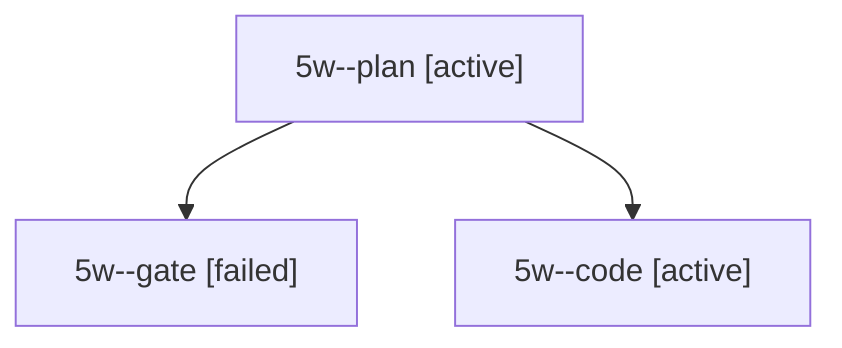

# Session: 5w

[Agent Hoods](../README.md) / [bbugyi200](../users/bbugyi200/README.md) / [apollo](../users/bbugyi200/machines/apollo/README.md) / [5w](../users/bbugyi200/machines/apollo/hoods/5w/README.md) / 5w

Owner: `bbugyi200.apollo` · Hood: `5w` · Members: 3

## Lineage

The diagram is an optional enhancement; the ordered table below contains the same lineage in accessible text.

| Role | Agent | State | Model / provider | Timing | Commits | Prompt | Chat |
|---|---|---|---|---|---:|---|---|
| plan | 5w--plan | active | opus / claude | 2026-10-08T17:30:29.942277+00:00 | 0 | [Prompt](../agents/bbugyi200.apollo.5w--plan/prompt.md) | [Chat](../agents/bbugyi200.apollo.5w--plan/chat.md) |
| gate | 5w--gate | failed | opus / claude | 2026-10-08T17:48:31.030263+00:00 → 2026-10-08T17:48:41.750272+00:00 | 0 | — | [Chat](../agents/bbugyi200.apollo.5w--gate/chat.md) |
| code | 5w--code | active | muse-spark-1.3-contributor / muse | 2026-10-08T17:49:03.893142+00:00 | 0 | — | — |
