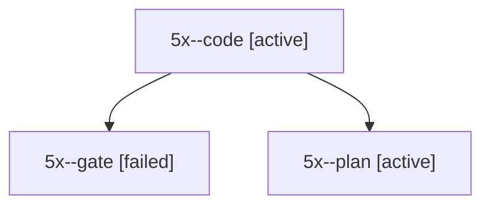

# Session: 5x

[Agent Hoods](../README.md) / [bbugyi200](../users/bbugyi200/README.md) / [apollo](../users/bbugyi200/machines/apollo/README.md) / [5x](../users/bbugyi200/machines/apollo/hoods/5x/README.md) / 5x

Owner: `bbugyi200.apollo` · Hood: `5x` · Members: 3

## Lineage

The diagram is an optional enhancement; the ordered table below contains the same lineage in accessible text.

| Role | Agent | State | Model / provider | Timing | Commits | Prompt | Chat |
|---|---|---|---|---|---:|---|---|
| code | 5x--code | active | muse-spark-1.3-contributor / muse | 2026-10-08T17:56:34.898345+00:00 | 0 | — | — |
| gate | 5x--gate | failed | opus / claude | 2026-10-08T17:56:00.241845+00:00 → 2026-10-08T17:56:12.197692+00:00 | 0 | — | [Chat](../agents/bbugyi200.apollo.5x--gate/chat.md) |
| plan | 5x--plan | active | opus / claude | 2026-10-08T17:50:36.853774+00:00 | 0 | [Prompt](../agents/bbugyi200.apollo.5x--plan/prompt.md) | [Chat](../agents/bbugyi200.apollo.5x--plan/chat.md) |
