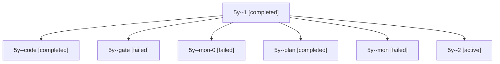

# Session: 5y

[Agent Hoods](../README.md) / [bbugyi200](../users/bbugyi200/README.md) / [apollo](../users/bbugyi200/machines/apollo/README.md) / [5y](../users/bbugyi200/machines/apollo/hoods/5y/README.md) / 5y

Owner: `bbugyi200.apollo` · Hood: `5y` · Members: 7

## Lineage

The diagram is an optional enhancement; the ordered table below contains the same lineage in accessible text.

| Role | Agent | State | Model / provider | Timing | Commits | Prompt | Chat |
|---|---|---|---|---|---:|---|---|
| 1 | 5y--1 | completed | muse-spark-1.3-contributor / muse | 2026-10-09T01:27:11.281974+00:00 → 2026-10-09T01:53:03.025772+00:00 | 0 | [Prompt](../agents/bbugyi200.apollo.5y--1/prompt.md) | [Chat](../agents/bbugyi200.apollo.5y--1/chat.md) |
| code | 5y--code | completed | muse-spark-1.3-contributor / muse | 2026-10-08T23:05:58.975428+00:00 → 2026-10-08T23:34:43.994061+00:00 | 0 | — | [Chat](../agents/bbugyi200.apollo.5y--code/chat.md) |
| gate | 5y--gate | failed | opus / claude | 2026-10-08T23:05:26.976375+00:00 → 2026-10-08T23:05:38.315781+00:00 | 0 | — | [Chat](../agents/bbugyi200.apollo.5y--gate/chat.md) |
| mon-0 | 5y--mon-0 | failed | muse-spark-1.3-contributor / muse | 2026-10-09T01:49:07.076895+00:00 → 2026-10-09T04:50:51.739614+00:00 | 0 | — | [Chat](../agents/bbugyi200.apollo.5y--mon-0/chat.md) |
| plan | 5y--plan | completed | opus / claude | 2026-10-08T22:43:07.600720+00:00 → 2026-10-08T23:34:43.994061+00:00 | 0 | [Prompt](../agents/bbugyi200.apollo.5y--plan/prompt.md) | [Chat](../agents/bbugyi200.apollo.5y--plan/chat.md) |
| mon | 5y--mon | failed | muse-spark-1.3-contributor / muse | 2026-10-08T23:33:59.482739+00:00 → 2026-10-09T00:35:58.863780+00:00 | 0 | — | [Chat](../agents/bbugyi200.apollo.5y--mon/chat.md) |
| 2 | 5y--2 | active | muse-spark-1.3-contributor / muse | 2026-10-09T04:51:57.477373+00:00 | [1](../agents/bbugyi200.apollo.5y--2/README.md#commits) | [Prompt](../agents/bbugyi200.apollo.5y--2/prompt.md) | — |

## Commits

| Role | Repo | Commit | Subject | Committed |
|---|---|---|---|---|
| 2 | sase | [`27e9393`](https://github.com/sase-org/sase/commit/27e939327b5f4ec149c15eccd68eda32b57a4d1c) | feat(completion): privatize runtime spec and grammar key with unkeyed-handle baseline | 2026-10-09 04:37:44 EDT |
