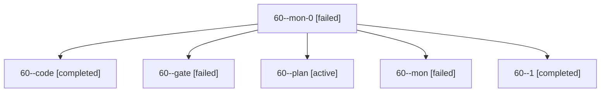

# Session: 60

[Agent Hoods](../README.md) / [bbugyi200](../users/bbugyi200/README.md) / [apollo](../users/bbugyi200/machines/apollo/README.md) / [60](../users/bbugyi200/machines/apollo/hoods/60/README.md) / 60

Owner: `bbugyi200.apollo` · Hood: `60` · Members: 6

## Lineage

The diagram is an optional enhancement; the ordered table below contains the same lineage in accessible text.

| Role | Agent | State | Model / provider | Timing | Commits | Prompt | Chat |
|---|---|---|---|---|---:|---|---|
| mon-0 | 60--mon-0 | failed | muse-spark-1.3-contributor / muse | 2026-10-09T11:36:28.739334+00:00 → 2026-10-09T12:55:13.529650+00:00 | 0 | — | [Chat](../agents/bbugyi200.apollo.60--mon-0/chat.md) |
| code | 60--code | completed | muse-spark-1.3-contributor / muse | 2026-10-09T09:57:41.263685+00:00 → 2026-10-09T10:28:15.118632+00:00 | 0 | — | [Chat](../agents/bbugyi200.apollo.60--code/chat.md) |
| gate | 60--gate | failed | opus / claude | 2026-10-09T09:56:35.553262+00:00 → 2026-10-09T09:56:57.051850+00:00 | 0 | — | [Chat](../agents/bbugyi200.apollo.60--gate/chat.md) |
| plan | 60--plan | active | opus / claude | 2026-10-09T09:39:13.921527+00:00 | 0 | [Prompt](../agents/bbugyi200.apollo.60--plan/prompt.md) | [Chat](../agents/bbugyi200.apollo.60--plan/chat.md) |
| mon | 60--mon | failed | muse-spark-1.3-contributor / muse | 2026-10-09T10:26:19.051604+00:00 → 2026-10-09T11:27:54.404100+00:00 | 0 | — | [Chat](../agents/bbugyi200.apollo.60--mon/chat.md) |
| 1 | 60--1 | completed | muse-spark-1.3-contributor / muse | 2026-10-09T11:29:01.409029+00:00 → 2026-10-09T11:38:40.945457+00:00 | 0 | [Prompt](../agents/bbugyi200.apollo.60--1/prompt.md) | [Chat](../agents/bbugyi200.apollo.60--1/chat.md) |

## Commits

| Role | Repo | Commit | Subject | Committed |
|---|---|---|---|---|
| — | sase | [`73b7db3`](https://github.com/sase-org/sase/commit/73b7db3afbd1c9951be5703247624ee58427728f) | fix: hide audit launcher marker notifications | 2026-07-11 14:39:15 EDT |
