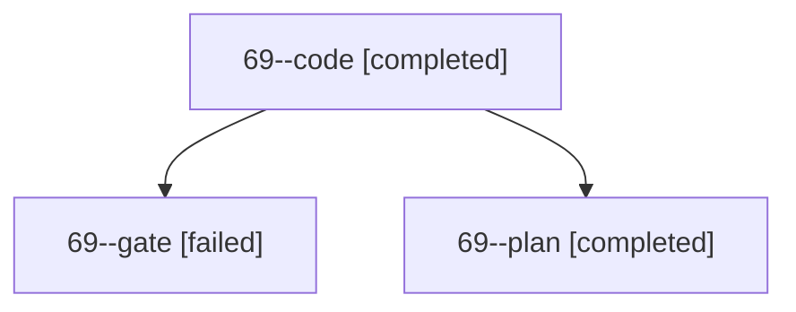

# Session: 69

[Agent Hoods](../README.md) / [bbugyi200](../users/bbugyi200/README.md) / [apollo](../users/bbugyi200/machines/apollo/README.md) / [69](../users/bbugyi200/machines/apollo/hoods/69/README.md) / 69

Owner: `bbugyi200.apollo` · Hood: `69` · Members: 3

## Lineage

The diagram is an optional enhancement; the ordered table below contains the same lineage in accessible text.

| Role | Agent | State | Model / provider | Timing | Commits | Prompt | Chat |
|---|---|---|---|---|---:|---|---|
| code | 69--code | completed | muse-spark-1.3-contributor / muse | 2026-10-10T16:15:32.782328+00:00 → 2026-10-10T17:56:43.166947+00:00 | [1](../agents/bbugyi200.apollo.69--code/README.md#commits) | — | [Chat](../agents/bbugyi200.apollo.69--code/chat.md) |
| gate | 69--gate | failed | gpt-6-astra / codex | 2026-10-10T16:14:49.456413+00:00 → 2026-10-10T16:15:05.068115+00:00 | 0 | — | [Chat](../agents/bbugyi200.apollo.69--gate/chat.md) |
| plan | 69--plan | completed | gpt-6-astra / codex | 2026-10-10T16:10:20.354966+00:00 → 2026-10-10T17:56:43.166947+00:00 | 0 | [Prompt](../agents/bbugyi200.apollo.69--plan/prompt.md) | [Chat](../agents/bbugyi200.apollo.69--plan/chat.md) |

## Commits

| Role | Repo | Commit | Subject | Committed |
|---|---|---|---|---|
| — | sase | [`7a4e0aa`](https://github.com/sase-org/sase/commit/7a4e0aa43156f74c7da77b335bf0b5fcefde9964) | chore: Add SDD prompt and plan for ace\_macbook\_sqlite\_sigbus | 2026-06-13 09:08:16 EDT |
| — | sase | [`265f3e9`](https://github.com/sase-org/sase/commit/265f3e90be0b37298aa26b3582b45accaf072a03) | fix: serialize artifact index startup maintenance | 2026-06-13 09:27:05 EDT |
| code | sase | [`217a543`](https://github.com/sase-org/sase/commit/217a5439f563d5f0ddf0ead6976d78695cd44178) | feat(ace): adapt update failure dialog to content and terminal size | 2026-10-10 13:54:33 EDT |

## Neighbors

| Agent | Relation | State |
|---|---|---|
| [69.f1](../agents/bbugyi200.apollo.69.f1/README.md) | descendant | completed |
