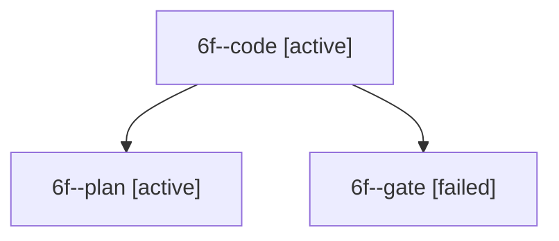

# Session: 6f

[Agent Hoods](../README.md) / [bbugyi200](../users/bbugyi200/README.md) / [apollo](../users/bbugyi200/machines/apollo/README.md) / [6f](../users/bbugyi200/machines/apollo/hoods/6f/README.md) / 6f

Owner: `bbugyi200.apollo` · Hood: `6f` · Members: 3

## Lineage

The diagram is an optional enhancement; the ordered table below contains the same lineage in accessible text.

| Role | Agent | State | Model / provider | Timing | Commits | Prompt | Chat |
|---|---|---|---|---|---:|---|---|
| code | 6f--code | active | muse-spark-1.3-contributor / muse | 2026-10-10T16:29:47.958525+00:00 | 0 | — | — |
| plan | 6f--plan | active | gpt-6-astra / codex | 2026-10-10T16:25:33.200494+00:00 | 0 | [Prompt](../agents/bbugyi200.apollo.6f--plan/prompt.md) | [Chat](../agents/bbugyi200.apollo.6f--plan/chat.md) |
| gate | 6f--gate | failed | gpt-6-astra / codex | 2026-10-10T16:28:59.529542+00:00 → 2026-10-10T16:29:18.438381+00:00 | 0 | — | [Chat](../agents/bbugyi200.apollo.6f--gate/chat.md) |

## Neighbors

| Agent | Relation | State |
|---|---|---|
| [6f.cld](../agents/bbugyi200.apollo.6f.cld/README.md) | descendant | completed |
| [6f.cld.f1.cdx](../agents/bbugyi200.apollo.6f.cld.f1.cdx/README.md) | descendant | completed |
| [6f.cld.f1.cdx.f1](../agents/bbugyi200.apollo.6f.cld.f1.cdx.f1/README.md) | descendant | completed |
