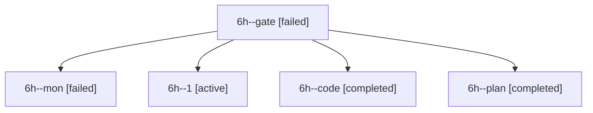

# Session: 6h

[Agent Hoods](../README.md) / [bbugyi200](../users/bbugyi200/README.md) / [apollo](../users/bbugyi200/machines/apollo/README.md) / [6h](../users/bbugyi200/machines/apollo/hoods/6h/README.md) / 6h

Owner: `bbugyi200.apollo` · Hood: `6h` · Members: 5

## Lineage

The diagram is an optional enhancement; the ordered table below contains the same lineage in accessible text.

| Role | Agent | State | Model / provider | Timing | Commits | Prompt | Chat |
|---|---|---|---|---|---:|---|---|
| gate | 6h--gate | failed | opus / claude | 2026-10-10T19:18:47.435415+00:00 → 2026-10-10T19:19:03.333698+00:00 | 0 | — | [Chat](../agents/bbugyi200.apollo.6h--gate/chat.md) |
| mon | 6h--mon | failed | grok-4.6 / grok | 2026-10-10T20:05:43.602307+00:00 → 2026-10-10T20:11:43.545583+00:00 | 0 | — | [Chat](../agents/bbugyi200.apollo.6h--mon/chat.md) |
| 1 | 6h--1 | active | grok-4.6 / grok | 2026-10-10T20:11:43.150171+00:00 | [1](../agents/bbugyi200.apollo.6h--1/README.md#commits) | [Prompt](../agents/bbugyi200.apollo.6h--1/prompt.md) | — |
| code | 6h--code | completed | grok-4.6 / grok | 2026-10-10T19:19:30.960899+00:00 → 2026-10-10T20:06:40.596580+00:00 | 0 | — | [Chat](../agents/bbugyi200.apollo.6h--code/chat.md) |
| plan | 6h--plan | completed | opus / claude | 2026-10-10T18:35:42.258755+00:00 → 2026-10-10T20:06:40.596580+00:00 | 0 | [Prompt](../agents/bbugyi200.apollo.6h--plan/prompt.md) | [Chat](../agents/bbugyi200.apollo.6h--plan/chat.md) |

## Commits

| Role | Repo | Commit | Subject | Committed |
|---|---|---|---|---|
| 1 | sase | [`cc0ec02`](https://github.com/sase-org/sase/commit/cc0ec027ace8a4b7bf34fee64108bce8b10f84b6) | fix(agents): stop live in-process handoffs from reading as finished | 2026-10-10 17:22:25 EDT |

## Neighbors

| Agent | Relation | State |
|---|---|---|
| [6h.cld](../agents/bbugyi200.apollo.6h.cld/README.md) | descendant | completed |
