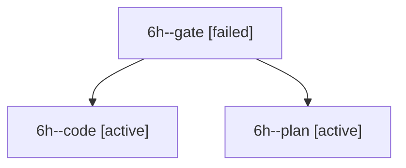

# Session: 6h

[Agent Hoods](../README.md) / [bbugyi200](../users/bbugyi200/README.md) / [apollo](../users/bbugyi200/machines/apollo/README.md) / [6h](../users/bbugyi200/machines/apollo/hoods/6h/README.md) / 6h

Owner: `bbugyi200.apollo` · Hood: `6h` · Members: 3

## Lineage

The diagram is an optional enhancement; the ordered table below contains the same lineage in accessible text.

| Role | Agent | State | Model / provider | Timing | Commits | Prompt | Chat |
|---|---|---|---|---|---:|---|---|
| gate | 6h--gate | failed | opus / claude | 2026-10-10T19:18:47.435415+00:00 → 2026-10-10T19:19:03.333698+00:00 | 0 | — | [Chat](../agents/bbugyi200.apollo.6h--gate/chat.md) |
| code | 6h--code | active | grok-4.6 / grok | 2026-10-10T19:19:30.960899+00:00 | 0 | — | — |
| plan | 6h--plan | active | opus / claude | 2026-10-10T18:35:42.258755+00:00 | 0 | [Prompt](../agents/bbugyi200.apollo.6h--plan/prompt.md) | [Chat](../agents/bbugyi200.apollo.6h--plan/chat.md) |

## Neighbors

| Agent | Relation | State |
|---|---|---|
| [6h.cld](../agents/bbugyi200.apollo.6h.cld/README.md) | descendant | completed |
