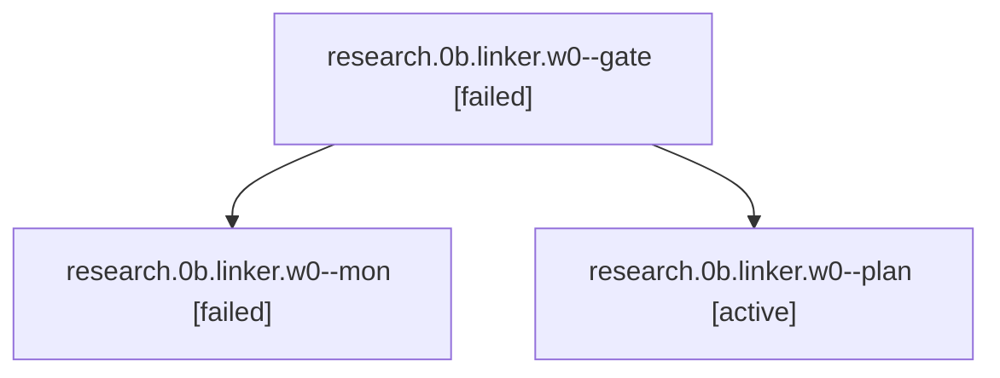

# Session: research.0b.linker.w0

[Agent Hoods](../README.md) / [bbugyi200](../users/bbugyi200/README.md) / [apollo](../users/bbugyi200/machines/apollo/README.md) / [research](../users/bbugyi200/machines/apollo/hoods/research/README.md) / research.0b.linker.w0

Owner: `bbugyi200.apollo` · Hood: `research` · Members: 3

## Lineage

The diagram is an optional enhancement; the ordered table below contains the same lineage in accessible text.

| Role | Agent | State | Model / provider | Timing | Commits | Prompt | Chat |
|---|---|---|---|---|---:|---|---|
| gate | research.0b.linker.w0--gate | failed | opus / claude | 2026-10-04T22:39:36.826735+00:00 → 2026-10-04T22:39:47.584654+00:00 | 0 | — | [Chat](../agents/bbugyi200.apollo.research.0b.linker.w0--gate/chat.md) |
| mon | research.0b.linker.w0--mon | failed | opus / claude | 2026-10-04T22:39:46.897781+00:00 → 2026-10-04T22:41:18.011594+00:00 | 0 | — | [Chat](../agents/bbugyi200.apollo.research.0b.linker.w0--mon/chat.md) |
| plan | research.0b.linker.w0--plan | active | opus / claude | 2026-10-04T22:22:30.658916+00:00 | 0 | [Prompt](../agents/bbugyi200.apollo.research.0b.linker.w0--plan/prompt.md) | [Chat](../agents/bbugyi200.apollo.research.0b.linker.w0--plan/chat.md) |

## Neighbors

| Agent | Relation | State |
|---|---|---|
| [research.0b.linker](../agents/bbugyi200.apollo.research.0b.linker/README.md) | ancestor | active |
| [research.0b.audio](../agents/bbugyi200.apollo.research.0b.audio/README.md) | research.0b hood | active |
| [research.0b.cdx](../agents/bbugyi200.apollo.research.0b.cdx/README.md) | research.0b hood | active |
| [research.0b.cld](../agents/bbugyi200.apollo.research.0b.cld/README.md) | research.0b hood | active |
| [research.0b.final](../agents/bbugyi200.apollo.research.0b.final/README.md) | research.0b hood | active |
| [research.0b.gem](../agents/bbugyi200.apollo.research.0b.gem/README.md) | research.0b hood | active |
| [research.0b.grk](../agents/bbugyi200.apollo.research.0b.grk/README.md) | research.0b hood | active |
| [research.0b.image](../agents/bbugyi200.apollo.research.0b.image/README.md) | research.0b hood | active |
| [research.0.cdx](../agents/bbugyi200.apollo.research.0.cdx/README.md) | research hood | active |
| [research.0.cld](../agents/bbugyi200.apollo.research.0.cld/README.md) | research hood | active |
| [research.0.final](../agents/bbugyi200.apollo.research.0.final/README.md) | research hood | active |
| [research.0.image](../agents/bbugyi200.apollo.research.0.image/README.md) | research hood | completed |
| [research.01.cdx](../agents/bbugyi200.apollo.research.01.cdx/README.md) | research hood | completed |
| [research.01.cld](../agents/bbugyi200.apollo.research.01.cld/README.md) | research hood | completed |
| [research.01.final](../agents/bbugyi200.apollo.research.01.final/README.md) | research hood | completed |
| [research.01.final.f0](../agents/bbugyi200.apollo.research.01.final.f0/README.md) | research hood | active |
| [research.01.image](../agents/bbugyi200.apollo.research.01.image/README.md) | research hood | completed |
| [research.02.cdx](../agents/bbugyi200.apollo.research.02.cdx/README.md) | research hood | active |
| [research.02.cld](../agents/bbugyi200.apollo.research.02.cld/README.md) | research hood | active |
| [research.02.final](../agents/bbugyi200.apollo.research.02.final/README.md) | research hood | active |
| [research.02.gem](../agents/bbugyi200.apollo.research.02.gem/README.md) | research hood | active |
| [research.02.grk](../agents/bbugyi200.apollo.research.02.grk/README.md) | research hood | active |
| [research.02.image](../agents/bbugyi200.apollo.research.02.image/README.md) | research hood | active |
| [research.02.linker](../agents/bbugyi200.apollo.research.02.linker/README.md) | research hood | active |
| [research.02.mus](../agents/bbugyi200.apollo.research.02.mus/README.md) | research hood | active |
| [research.03.cdx](../agents/bbugyi200.apollo.research.03.cdx/README.md) | research hood | completed |
| [research.03.cld](../agents/bbugyi200.apollo.research.03.cld/README.md) | research hood | completed |
| [research.03.final](../agents/bbugyi200.apollo.research.03.final/README.md) | research hood | completed |
| [research.03.image](../agents/bbugyi200.apollo.research.03.image/README.md) | research hood | completed |
| [research.04.cdx](../agents/bbugyi200.apollo.research.04.cdx/README.md) | research hood | completed |
| [research.04.cld](../agents/bbugyi200.apollo.research.04.cld/README.md) | research hood | completed |
| [research.04.final](../agents/bbugyi200.apollo.research.04.final/README.md) | research hood | completed |
| [research.04.image](../agents/bbugyi200.apollo.research.04.image/README.md) | research hood | completed |
| [research.05.cdx](../agents/bbugyi200.apollo.research.05.cdx/README.md) | research hood | completed |
| [research.05.cld](../agents/bbugyi200.apollo.research.05.cld/README.md) | research hood | completed |
| [research.05.final](../agents/bbugyi200.apollo.research.05.final/README.md) | research hood | completed |
| [research.05.image](../agents/bbugyi200.apollo.research.05.image/README.md) | research hood | completed |
| [research.06.cdx](../agents/bbugyi200.apollo.research.06.cdx/README.md) | research hood | completed |
| [research.06.cld](../agents/bbugyi200.apollo.research.06.cld/README.md) | research hood | completed |
| [research.06.final](../agents/bbugyi200.apollo.research.06.final/README.md) | research hood | completed |
| [research.06.image](../agents/bbugyi200.apollo.research.06.image/README.md) | research hood | completed |
| [research.07.cdx](../agents/bbugyi200.apollo.research.07.cdx/README.md) | research hood | completed |
| [research.07.cld](../agents/bbugyi200.apollo.research.07.cld/README.md) | research hood | completed |
| [research.07.final](../agents/bbugyi200.apollo.research.07.final/README.md) | research hood | completed |
| [research.07.final.f1](../agents/bbugyi200.apollo.research.07.final.f1/README.md) | research hood | completed |
| [research.07.image](../agents/bbugyi200.apollo.research.07.image/README.md) | research hood | completed |
| [research.08.audio](../agents/bbugyi200.apollo.research.08.audio/README.md) | research hood | active |
| [research.08.cdx](../agents/bbugyi200.apollo.research.08.cdx/README.md) | research hood | active |
| [research.08.cld](../agents/bbugyi200.apollo.research.08.cld/README.md) | research hood | active |
| [research.08.final](../agents/bbugyi200.apollo.research.08.final/README.md) | research hood | active |
| [research.08.gem](../agents/bbugyi200.apollo.research.08.gem/README.md) | research hood | active |
| [research.08.grk](../agents/bbugyi200.apollo.research.08.grk/README.md) | research hood | active |
| [research.08.image](../agents/bbugyi200.apollo.research.08.image/README.md) | research hood | active |
| [research.08.linker](../agents/bbugyi200.apollo.research.08.linker/README.md) | research hood | active |
| [research.09.audio](../agents/bbugyi200.apollo.research.09.audio/README.md) | research hood | active |
| [research.09.cdx](../agents/bbugyi200.apollo.research.09.cdx/README.md) | research hood | active |
| [research.09.cld](../agents/bbugyi200.apollo.research.09.cld/README.md) | research hood | active |
| [research.09.final](../agents/bbugyi200.apollo.research.09.final/README.md) | research hood | active |
| … and 387 more in the [hood roster](../users/bbugyi200/machines/apollo/hoods/research/README.md) | research hood | — |
