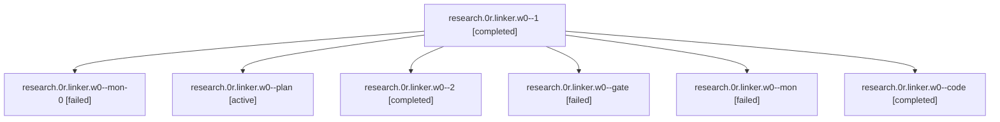

# Session: research.0r.linker.w0

[Agent Hoods](../README.md) / [bbugyi200](../users/bbugyi200/README.md) / [apollo](../users/bbugyi200/machines/apollo/README.md) / [research](../users/bbugyi200/machines/apollo/hoods/research/README.md) / research.0r.linker.w0

Owner: `bbugyi200.apollo` · Hood: `research` · Members: 7

## Lineage

The diagram is an optional enhancement; the ordered table below contains the same lineage in accessible text.

| Role | Agent | State | Model / provider | Timing | Commits | Prompt | Chat |
|---|---|---|---|---|---:|---|---|
| 1 | research.0r.linker.w0--1 | completed | muse-spark-1.3-contributor / muse | 2026-10-09T23:51:05.714394+00:00 → 2026-10-09T23:59:11.182750+00:00 | 0 | [Prompt](../agents/bbugyi200.apollo.research.0r.linker.w0--1/prompt.md) | [Chat](../agents/bbugyi200.apollo.research.0r.linker.w0--1/chat.md) |
| mon-0 | research.0r.linker.w0--mon-0 | failed | muse-spark-1.3-contributor / muse | 2026-10-09T23:58:36.455054+00:00 → 2026-10-10T00:06:54.531688+00:00 | 0 | — | [Chat](../agents/bbugyi200.apollo.research.0r.linker.w0--mon-0/chat.md) |
| plan | research.0r.linker.w0--plan | active | gpt-6-astra / codex | 2026-10-09T22:44:43.010899+00:00 | 0 | [Prompt](../agents/bbugyi200.apollo.research.0r.linker.w0--plan/prompt.md) | [Chat](../agents/bbugyi200.apollo.research.0r.linker.w0--plan/chat.md) |
| 2 | research.0r.linker.w0--2 | completed | muse-spark-1.3-contributor / muse | 2026-10-10T00:06:54.213792+00:00 → 2026-10-10T00:28:19.775722+00:00 | [1](../agents/bbugyi200.apollo.research.0r.linker.w0--2/README.md#commits) | [Prompt](../agents/bbugyi200.apollo.research.0r.linker.w0--2/prompt.md) | [Chat](../agents/bbugyi200.apollo.research.0r.linker.w0--2/chat.md) |
| gate | research.0r.linker.w0--gate | failed | gpt-6-astra / codex | 2026-10-09T22:49:23.885169+00:00 → 2026-10-09T22:49:34.857533+00:00 | 0 | — | [Chat](../agents/bbugyi200.apollo.research.0r.linker.w0--gate/chat.md) |
| mon | research.0r.linker.w0--mon | failed | muse-spark-1.3-contributor / muse | 2026-10-09T23:26:47.618546+00:00 → 2026-10-09T23:51:06.091168+00:00 | 0 | — | [Chat](../agents/bbugyi200.apollo.research.0r.linker.w0--mon/chat.md) |
| code | research.0r.linker.w0--code | completed | muse-spark-1.3-contributor / muse | 2026-10-09T22:49:56.049822+00:00 → 2026-10-09T23:27:23.048155+00:00 | 0 | — | [Chat](../agents/bbugyi200.apollo.research.0r.linker.w0--code/chat.md) |

## Commits

| Role | Repo | Commit | Subject | Committed |
|---|---|---|---|---|
| 2 | sase | [`8150a76`](https://github.com/sase-org/sase/commit/8150a76d46e21cc0974b763a019f1078ca671641) | fix(ace): follow live Reply for workflow agent rows via is\_agent\_entry | 2026-10-09 20:26:04 EDT |

## Neighbors

| Agent | Relation | State |
|---|---|---|
| [research.0r.linker](../agents/bbugyi200.apollo.research.0r.linker/README.md) | ancestor | active |
| [research.0r.cdx](../agents/bbugyi200.apollo.research.0r.cdx/README.md) | research.0r hood | active |
| [research.0r.cld](../agents/bbugyi200.apollo.research.0r.cld/README.md) | research.0r hood | completed |
| [research.0r.final](../agents/bbugyi200.apollo.research.0r.final/README.md) | research.0r hood | active |
| [research.0r.gem](../agents/bbugyi200.apollo.research.0r.gem/README.md) | research.0r hood | active |
| [research.0r.grk](../agents/bbugyi200.apollo.research.0r.grk/README.md) | research.0r hood | active |
| [research.0r.image](../agents/bbugyi200.apollo.research.0r.image/README.md) | research.0r hood | active |
| [research.0r.mus](../agents/bbugyi200.apollo.research.0r.mus/README.md) | research.0r hood | active |
| [research.0.cdx](../agents/bbugyi200.apollo.research.0.cdx/README.md) | research hood | active |
| [research.0.cld](../agents/bbugyi200.apollo.research.0.cld/README.md) | research hood | active |
| [research.0.final](../agents/bbugyi200.apollo.research.0.final/README.md) | research hood | active |
| [research.0.image](../agents/bbugyi200.apollo.research.0.image/README.md) | research hood | completed |
| [research.01.cdx](../agents/bbugyi200.apollo.research.01.cdx/README.md) | research hood | completed |
| [research.01.cld](../agents/bbugyi200.apollo.research.01.cld/README.md) | research hood | completed |
| [research.01.final](../agents/bbugyi200.apollo.research.01.final/README.md) | research hood | completed |
| [research.01.final.f0](../agents/bbugyi200.apollo.research.01.final.f0/README.md) | research hood | active |
| [research.01.image](../agents/bbugyi200.apollo.research.01.image/README.md) | research hood | completed |
| [research.02.cdx](../agents/bbugyi200.apollo.research.02.cdx/README.md) | research hood | active |
| [research.02.cld](../agents/bbugyi200.apollo.research.02.cld/README.md) | research hood | active |
| [research.02.final](../agents/bbugyi200.apollo.research.02.final/README.md) | research hood | active |
| [research.02.gem](../agents/bbugyi200.apollo.research.02.gem/README.md) | research hood | active |
| [research.02.grk](../agents/bbugyi200.apollo.research.02.grk/README.md) | research hood | active |
| [research.02.image](../agents/bbugyi200.apollo.research.02.image/README.md) | research hood | active |
| [research.02.linker](../agents/bbugyi200.apollo.research.02.linker/README.md) | research hood | active |
| [research.02.mus](../agents/bbugyi200.apollo.research.02.mus/README.md) | research hood | active |
| [research.03.cdx](../agents/bbugyi200.apollo.research.03.cdx/README.md) | research hood | completed |
| [research.03.cld](../agents/bbugyi200.apollo.research.03.cld/README.md) | research hood | completed |
| [research.03.final](../agents/bbugyi200.apollo.research.03.final/README.md) | research hood | completed |
| [research.03.image](../agents/bbugyi200.apollo.research.03.image/README.md) | research hood | completed |
| [research.04.cdx](../agents/bbugyi200.apollo.research.04.cdx/README.md) | research hood | completed |
| [research.04.cld](../agents/bbugyi200.apollo.research.04.cld/README.md) | research hood | completed |
| [research.04.final](../agents/bbugyi200.apollo.research.04.final/README.md) | research hood | completed |
| [research.04.image](../agents/bbugyi200.apollo.research.04.image/README.md) | research hood | completed |
| [research.05.cdx](../agents/bbugyi200.apollo.research.05.cdx/README.md) | research hood | completed |
| [research.05.cld](../agents/bbugyi200.apollo.research.05.cld/README.md) | research hood | completed |
| [research.05.final](../agents/bbugyi200.apollo.research.05.final/README.md) | research hood | completed |
| [research.05.image](../agents/bbugyi200.apollo.research.05.image/README.md) | research hood | completed |
| [research.06.cdx](../agents/bbugyi200.apollo.research.06.cdx/README.md) | research hood | completed |
| [research.06.cld](../agents/bbugyi200.apollo.research.06.cld/README.md) | research hood | completed |
| [research.06.final](../agents/bbugyi200.apollo.research.06.final/README.md) | research hood | completed |
| [research.06.image](../agents/bbugyi200.apollo.research.06.image/README.md) | research hood | completed |
| [research.07.cdx](../agents/bbugyi200.apollo.research.07.cdx/README.md) | research hood | completed |
| [research.07.cld](../agents/bbugyi200.apollo.research.07.cld/README.md) | research hood | completed |
| [research.07.final](../agents/bbugyi200.apollo.research.07.final/README.md) | research hood | completed |
| [research.07.final.f1](../agents/bbugyi200.apollo.research.07.final.f1/README.md) | research hood | completed |
| [research.07.image](../agents/bbugyi200.apollo.research.07.image/README.md) | research hood | completed |
| [research.08.audio](../agents/bbugyi200.apollo.research.08.audio/README.md) | research hood | active |
| [research.08.cdx](../agents/bbugyi200.apollo.research.08.cdx/README.md) | research hood | active |
| [research.08.cld](../agents/bbugyi200.apollo.research.08.cld/README.md) | research hood | active |
| [research.08.final](../agents/bbugyi200.apollo.research.08.final/README.md) | research hood | active |
| [research.08.gem](../agents/bbugyi200.apollo.research.08.gem/README.md) | research hood | active |
| [research.08.grk](../agents/bbugyi200.apollo.research.08.grk/README.md) | research hood | active |
| [research.08.image](../agents/bbugyi200.apollo.research.08.image/README.md) | research hood | active |
| [research.08.linker](../agents/bbugyi200.apollo.research.08.linker/README.md) | research hood | active |
| [research.09.audio](../agents/bbugyi200.apollo.research.09.audio/README.md) | research hood | active |
| [research.09.cdx](../agents/bbugyi200.apollo.research.09.cdx/README.md) | research hood | active |
| [research.09.cld](../agents/bbugyi200.apollo.research.09.cld/README.md) | research hood | active |
| [research.09.final](../agents/bbugyi200.apollo.research.09.final/README.md) | research hood | active |
| … and 379 more in the [hood roster](../users/bbugyi200/machines/apollo/hoods/research/README.md) | research hood | — |
