# Session: sase-1fs.3

[Agent Hoods](../README.md) / [bbugyi200](../users/bbugyi200/README.md) / [apollo](../users/bbugyi200/machines/apollo/README.md) / [sase-1fs](../users/bbugyi200/machines/apollo/hoods/sase-1fs/README.md) / sase-1fs.3

Owner: `bbugyi200.apollo` · Hood: `sase-1fs` · Members: 17 · Bead: [sase-1fs.3](https://github.com/sase-org/sase--beads/blob/main/pages/sase-1fs/sase-1fs.3.md)

## Lineage

```mermaid
flowchart TD
  n0["sase-1fs.3--mon-0 [failed]"]
  n1["sase-1fs.3--plan [completed]"]
  n0 --> n1
  n2["sase-1fs.3--mon-6 [failed]"]
  n0 --> n2
  n3["sase-1fs.3--1 [completed]"]
  n0 --> n3
  n4["sase-1fs.3--mon [failed]"]
  n0 --> n4
  n5["sase-1fs.3--mon-1 [failed]"]
  n0 --> n5
  n6["sase-1fs.3--6 [completed]"]
  n0 --> n6
  n7["sase-1fs.3--mon-5 [failed]"]
  n0 --> n7
  n8["sase-1fs.3--2 [completed]"]
  n0 --> n8
  n9["sase-1fs.3--8 [completed]"]
  n0 --> n9
  n10["sase-1fs.3--3 [completed]"]
  n0 --> n10
  n11["sase-1fs.3--mon-3 [failed]"]
  n0 --> n11
  n12["sase-1fs.3--7 [completed]"]
  n0 --> n12
  n13["sase-1fs.3--4 [completed]"]
  n0 --> n13
  n14["sase-1fs.3--mon-2 [failed]"]
  n0 --> n14
  n15["sase-1fs.3--mon-4 [failed]"]
  n0 --> n15
  n16["sase-1fs.3--5 [completed]"]
  n0 --> n16
```

The diagram is an optional enhancement; the ordered table below contains the same lineage in accessible text.

| Role | Agent | State | Model / provider | Timing | Commits | Prompt | Chat |
|---|---|---|---|---|---:|---|---|
| mon-0 | sase-1fs.3--mon-0 | failed | gpt-6-luna / codex | 2026-10-03T22:02:47.666819+00:00 → 2026-10-03T22:05:13.058540+00:00 | 0 | — | [Chat](../agents/bbugyi200.apollo.sase-1fs.3--mon-0/chat.md) |
| plan | sase-1fs.3--plan | completed | gpt-6-luna / codex | 2026-10-03T21:10:06.457737+00:00 → 2026-10-03T21:36:19.718202+00:00 | 0 | [Prompt](../agents/bbugyi200.apollo.sase-1fs.3--plan/prompt.md) | [Chat](../agents/bbugyi200.apollo.sase-1fs.3--plan/chat.md) |
| mon-6 | sase-1fs.3--mon-6 | failed | gpt-6-luna / codex | 2026-10-04T00:29:41.216825+00:00 → 2026-10-04T00:36:07.315548+00:00 | 0 | — | [Chat](../agents/bbugyi200.apollo.sase-1fs.3--mon-6/chat.md) |
| 1 | sase-1fs.3--1 | completed | gpt-6-luna / codex | 2026-10-03T21:57:50.995238+00:00 → 2026-10-03T22:03:13.098229+00:00 | 0 | [Prompt](../agents/bbugyi200.apollo.sase-1fs.3--1/prompt.md) | [Chat](../agents/bbugyi200.apollo.sase-1fs.3--1/chat.md) |
| mon | sase-1fs.3--mon | failed | gpt-6-luna / codex | 2026-10-03T21:35:41.960197+00:00 → 2026-10-03T21:57:51.461099+00:00 | 0 | — | [Chat](../agents/bbugyi200.apollo.sase-1fs.3--mon/chat.md) |
| mon-1 | sase-1fs.3--mon-1 | failed | gpt-6-luna / codex | 2026-10-03T22:28:40.782496+00:00 → 2026-10-03T22:30:40.267584+00:00 | 0 | — | [Chat](../agents/bbugyi200.apollo.sase-1fs.3--mon-1/chat.md) |
| 6 | sase-1fs.3--6 | completed | gpt-6-luna / codex | 2026-10-03T23:45:52.135008+00:00 → 2026-10-04T00:02:05.685858+00:00 | 0 | [Prompt](../agents/bbugyi200.apollo.sase-1fs.3--6/prompt.md) | [Chat](../agents/bbugyi200.apollo.sase-1fs.3--6/chat.md) |
| mon-5 | sase-1fs.3--mon-5 | failed | gpt-6-luna / codex | 2026-10-04T00:01:40.250459+00:00 → 2026-10-04T00:02:34.698638+00:00 | 0 | — | [Chat](../agents/bbugyi200.apollo.sase-1fs.3--mon-5/chat.md) |
| 2 | sase-1fs.3--2 | completed | gpt-6-luna / codex | 2026-10-03T22:05:12.600352+00:00 → 2026-10-03T22:29:07.378669+00:00 | 0 | [Prompt](../agents/bbugyi200.apollo.sase-1fs.3--2/prompt.md) | [Chat](../agents/bbugyi200.apollo.sase-1fs.3--2/chat.md) |
| 8 | sase-1fs.3--8 | completed | gpt-6-luna / codex | 2026-10-04T00:36:07.068405+00:00 → 2026-10-04T00:39:27.266947+00:00 | 0 | [Prompt](../agents/bbugyi200.apollo.sase-1fs.3--8/prompt.md) | [Chat](../agents/bbugyi200.apollo.sase-1fs.3--8/chat.md) |
| 3 | sase-1fs.3--3 | completed | gpt-6-luna / codex | 2026-10-03T22:30:40.153443+00:00 → 2026-10-03T22:58:42.254053+00:00 | 0 | [Prompt](../agents/bbugyi200.apollo.sase-1fs.3--3/prompt.md) | [Chat](../agents/bbugyi200.apollo.sase-1fs.3--3/chat.md) |
| mon-3 | sase-1fs.3--mon-3 | failed | gpt-6-luna / codex | 2026-10-03T23:25:16.822875+00:00 → 2026-10-03T23:27:26.581723+00:00 | 0 | — | [Chat](../agents/bbugyi200.apollo.sase-1fs.3--mon-3/chat.md) |
| 7 | sase-1fs.3--7 | completed | gpt-6-luna / codex | 2026-10-04T00:02:34.392951+00:00 → 2026-10-04T00:30:09.362017+00:00 | 0 | [Prompt](../agents/bbugyi200.apollo.sase-1fs.3--7/prompt.md) | [Chat](../agents/bbugyi200.apollo.sase-1fs.3--7/chat.md) |
| 4 | sase-1fs.3--4 | completed | gpt-6-luna / codex | 2026-10-03T23:00:07.133600+00:00 → 2026-10-03T23:25:42.361545+00:00 | 0 | [Prompt](../agents/bbugyi200.apollo.sase-1fs.3--4/prompt.md) | [Chat](../agents/bbugyi200.apollo.sase-1fs.3--4/chat.md) |
| mon-2 | sase-1fs.3--mon-2 | failed | gpt-6-luna / codex | 2026-10-03T22:58:16.520342+00:00 → 2026-10-03T23:00:07.210275+00:00 | 0 | — | [Chat](../agents/bbugyi200.apollo.sase-1fs.3--mon-2/chat.md) |
| mon-4 | sase-1fs.3--mon-4 | failed | gpt-6-luna / codex | 2026-10-03T23:44:54.421677+00:00 → 2026-10-03T23:45:52.393783+00:00 | 0 | — | [Chat](../agents/bbugyi200.apollo.sase-1fs.3--mon-4/chat.md) |
| 5 | sase-1fs.3--5 | completed | gpt-6-luna / codex | 2026-10-03T23:27:26.539063+00:00 → 2026-10-03T23:45:21.067113+00:00 | 0 | [Prompt](../agents/bbugyi200.apollo.sase-1fs.3--5/prompt.md) | [Chat](../agents/bbugyi200.apollo.sase-1fs.3--5/chat.md) |

## Neighbors

| Agent | Relation | State |
|---|---|---|
| [sase-1fs.1](../agents/bbugyi200.apollo.sase-1fs.1/README.md) | sase-1fs hood | completed |
| [sase-1fs.2](../agents/bbugyi200.apollo.sase-1fs.2/README.md) | sase-1fs hood | completed |
| [sase-1fs.land](../agents/bbugyi200.apollo.sase-1fs.land/README.md) | sase-1fs hood | active |
