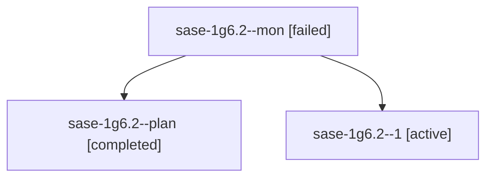

# Session: sase-1g6.2

[Agent Hoods](../README.md) / [bbugyi200](../users/bbugyi200/README.md) / [apollo](../users/bbugyi200/machines/apollo/README.md) / [sase-1g6](../users/bbugyi200/machines/apollo/hoods/sase-1g6/README.md) / sase-1g6.2

Owner: `bbugyi200.apollo` · Hood: `sase-1g6` · Members: 3 · Bead: [sase-1g6.2](https://github.com/sase-org/sase--beads/blob/main/pages/sase-1g6/sase-1g6.2.md)

## Lineage

The diagram is an optional enhancement; the ordered table below contains the same lineage in accessible text.

| Role | Agent | State | Model / provider | Timing | Commits | Prompt | Chat |
|---|---|---|---|---|---:|---|---|
| mon | sase-1g6.2--mon | failed | gpt-6-luna / codex | 2026-10-04T23:15:13.264972+00:00 → 2026-10-04T23:16:19.801404+00:00 | 0 | — | [Chat](../agents/bbugyi200.apollo.sase-1g6.2--mon/chat.md) |
| plan | sase-1g6.2--plan | completed | gpt-6-luna / codex | 2026-10-04T22:41:17.987866+00:00 → 2026-10-04T23:15:45.871725+00:00 | 0 | [Prompt](../agents/bbugyi200.apollo.sase-1g6.2--plan/prompt.md) | [Chat](../agents/bbugyi200.apollo.sase-1g6.2--plan/chat.md) |
| 1 | sase-1g6.2--1 | active | gpt-6-luna / codex | 2026-10-04T23:16:19.585669+00:00 | 0 | [Prompt](../agents/bbugyi200.apollo.sase-1g6.2--1/prompt.md) | — |

## Neighbors

| Agent | Relation | State |
|---|---|---|
| [sase-1g6.1](../agents/bbugyi200.apollo.sase-1g6.1/README.md) | sase-1g6 hood | active |
| [sase-1g6.3](../agents/bbugyi200.apollo.sase-1g6.3/README.md) | sase-1g6 hood | waiting |
| [sase-1g6.4](../agents/bbugyi200.apollo.sase-1g6.4/README.md) | sase-1g6 hood | waiting |
| [sase-1g6.land](../agents/bbugyi200.apollo.sase-1g6.land/README.md) | sase-1g6 hood | waiting |
