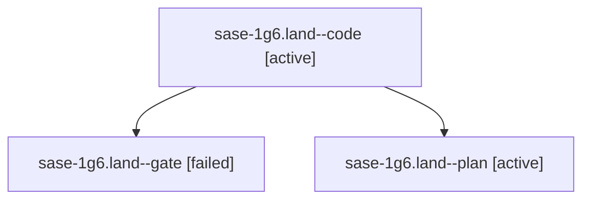

# Session: sase-1g6.land

[Agent Hoods](../README.md) / [bbugyi200](../users/bbugyi200/README.md) / [apollo](../users/bbugyi200/machines/apollo/README.md) / [sase-1g6](../users/bbugyi200/machines/apollo/hoods/sase-1g6/README.md) / sase-1g6.land

Owner: `bbugyi200.apollo` · Hood: `sase-1g6` · Members: 3 · Bead: [sase-1g6](https://github.com/sase-org/sase--beads/blob/main/pages/sase-1g6/README.md)

## Lineage

The diagram is an optional enhancement; the ordered table below contains the same lineage in accessible text.

| Role | Agent | State | Model / provider | Timing | Commits | Prompt | Chat |
|---|---|---|---|---|---:|---|---|
| code | sase-1g6.land--code | active | muse-spark-1.3-contributor / muse | 2026-10-05T01:04:58.252684+00:00 | 0 | — | — |
| gate | sase-1g6.land--gate | failed | grok-4.7 / grok | 2026-10-05T01:04:26.315408+00:00 → 2026-10-05T01:04:39.906165+00:00 | 0 | — | [Chat](../agents/bbugyi200.apollo.sase-1g6.land--gate/chat.md) |
| plan | sase-1g6.land--plan | active | grok-4.7 / grok | 2026-10-05T00:49:41.473032+00:00 | 0 | [Prompt](../agents/bbugyi200.apollo.sase-1g6.land--plan/prompt.md) | [Chat](../agents/bbugyi200.apollo.sase-1g6.land--plan/chat.md) |

## Neighbors

| Agent | Relation | State |
|---|---|---|
| [sase-1g6.1](../agents/bbugyi200.apollo.sase-1g6.1/README.md) | sase-1g6 hood | completed |
| [sase-1g6.2](bbugyi200.apollo.sase-1g6.2.md) (session · 5) | sase-1g6 hood | completed 3, failed 2 |
| [sase-1g6.3](../agents/bbugyi200.apollo.sase-1g6.3/README.md) | sase-1g6 hood | completed |
| [sase-1g6.4](../agents/bbugyi200.apollo.sase-1g6.4/README.md) | sase-1g6 hood | completed |
