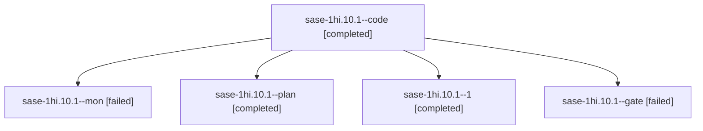

# Session: sase-1hi.10.1

[Agent Hoods](../README.md) / [bbugyi200](../users/bbugyi200/README.md) / [apollo](../users/bbugyi200/machines/apollo/README.md) / [sase-1hi](../users/bbugyi200/machines/apollo/hoods/sase-1hi/README.md) / sase-1hi.10.1

Owner: `bbugyi200.apollo` · Hood: `sase-1hi` · Members: 5 · Bead: [sase-1hi.10.1](https://github.com/sase-org/sase--beads/blob/main/pages/sase-1hi/sase-1hi.10.1.md)

## Lineage

The diagram is an optional enhancement; the ordered table below contains the same lineage in accessible text.

| Role | Agent | State | Model / provider | Timing | Commits | Prompt | Chat |
|---|---|---|---|---|---:|---|---|
| code | sase-1hi.10.1--code | completed | muse-spark-1.3-contributor / muse | 2026-10-08T09:36:54.441784+00:00 → 2026-10-08T09:48:51.283372+00:00 | 0 | — | [Chat](../agents/bbugyi200.apollo.sase-1hi.10.1--code/chat.md) |
| mon | sase-1hi.10.1--mon | failed | muse-spark-1.3-contributor / muse | 2026-10-08T09:48:22.246176+00:00 → 2026-10-08T09:50:46.063899+00:00 | 0 | — | [Chat](../agents/bbugyi200.apollo.sase-1hi.10.1--mon/chat.md) |
| plan | sase-1hi.10.1--plan | completed | gpt-6.1-sol / codex | 2026-10-08T09:27:49.645312+00:00 → 2026-10-08T09:48:51.283372+00:00 | 0 | [Prompt](../agents/bbugyi200.apollo.sase-1hi.10.1--plan/prompt.md) | [Chat](../agents/bbugyi200.apollo.sase-1hi.10.1--plan/chat.md) |
| 1 | sase-1hi.10.1--1 | completed | muse-spark-1.3-contributor / muse | 2026-10-08T09:50:45.622460+00:00 → 2026-10-08T10:25:23.062089+00:00 | [1](../agents/bbugyi200.apollo.sase-1hi.10.1--1/README.md#commits) | [Prompt](../agents/bbugyi200.apollo.sase-1hi.10.1--1/prompt.md) | [Chat](../agents/bbugyi200.apollo.sase-1hi.10.1--1/chat.md) |
| gate | sase-1hi.10.1--gate | failed | gpt-6.1-sol / codex | 2026-10-08T09:36:24.705473+00:00 → 2026-10-08T09:36:35.903338+00:00 | 0 | — | [Chat](../agents/bbugyi200.apollo.sase-1hi.10.1--gate/chat.md) |

## Commits

| Role | Repo | Commit | Subject | Committed |
|---|---|---|---|---|
| 1 | sase | [`c929bb1`](https://github.com/sase-org/sase/commit/c929bb176b7ecbc1f8dc8a96aad5863a80d08a65) | feat(plan): repair gate decision acceptance, stamps, validation, and grants | 2026-10-08 06:21:40 EDT |

## Neighbors

| Agent | Relation | State |
|---|---|---|
| [sase-1hi.10.2](bbugyi200.apollo.sase-1hi.10.2.md) (session · 11) | sase-1hi.10 hood | completed 6, failed 5 |
| [sase-1hi.10.3](bbugyi200.apollo.sase-1hi.10.3.md) (session · 3) | sase-1hi.10 hood | completed 2, failed 1 |
| [sase-1hi.10.4](bbugyi200.apollo.sase-1hi.10.4.md) (session · 5) | sase-1hi.10 hood | completed 3, failed 2 |
| [sase-1hi.10.5](bbugyi200.apollo.sase-1hi.10.5.md) (session · 3) | sase-1hi.10 hood | active 1, completed 1, failed 1 |
| [sase-1hi.10.6](bbugyi200.apollo.sase-1hi.10.6.md) (session · 6) | sase-1hi.10 hood | active 1, completed 3, failed 2 |
| [sase-1hi.10.land](../agents/bbugyi200.apollo.sase-1hi.10.land/README.md) | sase-1hi.10 hood | waiting |
| [sase-1hi.1](bbugyi200.apollo.sase-1hi.1.md) (session · 3) | sase-1hi hood | failed 3 |
| [sase-1hi.1.1.1](../agents/bbugyi200.apollo.sase-1hi.1.1.1/README.md) | sase-1hi hood | completed |
| [sase-1hi.1.1.2](../agents/bbugyi200.apollo.sase-1hi.1.1.2/README.md) | sase-1hi hood | completed |
| [sase-1hi.1.1.3](../agents/bbugyi200.apollo.sase-1hi.1.1.3/README.md) | sase-1hi hood | completed |
| [sase-1hi.1.1.4](../agents/bbugyi200.apollo.sase-1hi.1.1.4/README.md) | sase-1hi hood | completed |
| [sase-1hi.1.1.land](bbugyi200.apollo.sase-1hi.1.1.land.md) (session · 3) | sase-1hi hood | completed 2, failed 1 |
| [sase-1hi.2](../agents/bbugyi200.apollo.sase-1hi.2/README.md) | sase-1hi hood | completed |
| [sase-1hi.3](bbugyi200.apollo.sase-1hi.3.md) (session · 7) | sase-1hi hood | completed 4, failed 3 |
| [sase-1hi.4](../agents/bbugyi200.apollo.sase-1hi.4/README.md) | sase-1hi hood | completed |
| [sase-1hi.5](../agents/bbugyi200.apollo.sase-1hi.5/README.md) | sase-1hi hood | completed |
| [sase-1hi.6](bbugyi200.apollo.sase-1hi.6.md) (session · 7) | sase-1hi hood | completed 4, failed 3 |
| [sase-1hi.7](bbugyi200.apollo.sase-1hi.7.md) (session · 5) | sase-1hi hood | completed 3, failed 2 |
| [sase-1hi.8](bbugyi200.apollo.sase-1hi.8.md) (session · 3) | sase-1hi hood | completed 2, failed 1 |
| [sase-1hi.9](../agents/bbugyi200.apollo.sase-1hi.9/README.md) | sase-1hi hood | completed |
| [sase-1hi.land](bbugyi200.apollo.sase-1hi.land.md) (session · 3) | sase-1hi hood | failed 3 |
