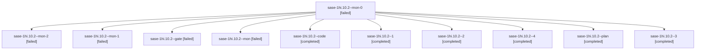

# Session: sase-1hi.10.2

[Agent Hoods](../README.md) / [bbugyi200](../users/bbugyi200/README.md) / [apollo](../users/bbugyi200/machines/apollo/README.md) / [sase-1hi](../users/bbugyi200/machines/apollo/hoods/sase-1hi/README.md) / sase-1hi.10.2

Owner: `bbugyi200.apollo` · Hood: `sase-1hi` · Members: 11 · Bead: [sase-1hi.10.2](https://github.com/sase-org/sase--beads/blob/main/pages/sase-1hi/sase-1hi.10.2.md)

## Lineage

The diagram is an optional enhancement; the ordered table below contains the same lineage in accessible text.

| Role | Agent | State | Model / provider | Timing | Commits | Prompt | Chat |
|---|---|---|---|---|---:|---|---|
| mon-0 | sase-1hi.10.2--mon-0 | failed | muse-spark-1.3-contributor / muse | 2026-10-08T11:31:00.625751+00:00 → 2026-10-08T12:11:45.386653+00:00 | 0 | — | [Chat](../agents/bbugyi200.apollo.sase-1hi.10.2--mon-0/chat.md) |
| mon-2 | sase-1hi.10.2--mon-2 | failed | muse-spark-1.3-contributor / muse | 2026-10-08T12:55:28.601773+00:00 → 2026-10-08T13:56:16.569575+00:00 | 0 | — | [Chat](../agents/bbugyi200.apollo.sase-1hi.10.2--mon-2/chat.md) |
| mon-1 | sase-1hi.10.2--mon-1 | failed | muse-spark-1.3-contributor / muse | 2026-10-08T12:20:29.851772+00:00 → 2026-10-08T12:46:35.174349+00:00 | 0 | — | [Chat](../agents/bbugyi200.apollo.sase-1hi.10.2--mon-1/chat.md) |
| gate | sase-1hi.10.2--gate | failed | grok-4.7 / grok | 2026-10-08T10:43:58.495579+00:00 → 2026-10-08T10:44:09.949165+00:00 | 0 | — | [Chat](../agents/bbugyi200.apollo.sase-1hi.10.2--gate/chat.md) |
| mon | sase-1hi.10.2--mon | failed | muse-spark-1.3-contributor / muse | 2026-10-08T11:08:13.658532+00:00 → 2026-10-08T11:10:58.527996+00:00 | 0 | — | [Chat](../agents/bbugyi200.apollo.sase-1hi.10.2--mon/chat.md) |
| code | sase-1hi.10.2--code | completed | muse-spark-1.3-contributor / muse | 2026-10-08T10:44:29.223894+00:00 → 2026-10-08T11:08:49.337758+00:00 | 0 | — | [Chat](../agents/bbugyi200.apollo.sase-1hi.10.2--code/chat.md) |
| 1 | sase-1hi.10.2--1 | completed | muse-spark-1.3-contributor / muse | 2026-10-08T11:10:58.352065+00:00 → 2026-10-08T11:31:51.665582+00:00 | 0 | [Prompt](../agents/bbugyi200.apollo.sase-1hi.10.2--1/prompt.md) | [Chat](../agents/bbugyi200.apollo.sase-1hi.10.2--1/chat.md) |
| 2 | sase-1hi.10.2--2 | completed | muse-spark-1.3-contributor / muse | 2026-10-08T12:11:44.894921+00:00 → 2026-10-08T12:21:02.371357+00:00 | 0 | [Prompt](../agents/bbugyi200.apollo.sase-1hi.10.2--2/prompt.md) | [Chat](../agents/bbugyi200.apollo.sase-1hi.10.2--2/chat.md) |
| 4 | sase-1hi.10.2--4 | completed | muse-spark-1.3-contributor / muse | 2026-10-08T13:56:16.407253+00:00 → 2026-10-08T14:06:13.659999+00:00 | [1](../agents/bbugyi200.apollo.sase-1hi.10.2--4/README.md#commits) | [Prompt](../agents/bbugyi200.apollo.sase-1hi.10.2--4/prompt.md) | [Chat](../agents/bbugyi200.apollo.sase-1hi.10.2--4/chat.md) |
| plan | sase-1hi.10.2--plan | completed | grok-4.7 / grok | 2026-10-08T10:25:11.784633+00:00 → 2026-10-08T11:08:49.337758+00:00 | 0 | [Prompt](../agents/bbugyi200.apollo.sase-1hi.10.2--plan/prompt.md) | [Chat](../agents/bbugyi200.apollo.sase-1hi.10.2--plan/chat.md) |
| 3 | sase-1hi.10.2--3 | completed | muse-spark-1.3-contributor / muse | 2026-10-08T12:46:38.630905+00:00 → 2026-10-08T12:56:01.782673+00:00 | 0 | [Prompt](../agents/bbugyi200.apollo.sase-1hi.10.2--3/prompt.md) | [Chat](../agents/bbugyi200.apollo.sase-1hi.10.2--3/chat.md) |

## Commits

| Role | Repo | Commit | Subject | Committed |
|---|---|---|---|---|
| 4 | sase | [`6828ed3`](https://github.com/sase-org/sase/commit/6828ed3836b8e1d0d7dcbab28e696fc208f444e5) | feat(plan): environment-independent accepted decision sheets and handoff repairs | 2026-10-08 10:03:29 EDT |

## Neighbors

| Agent | Relation | State |
|---|---|---|
| [sase-1hi.10.1](bbugyi200.apollo.sase-1hi.10.1.md) (session · 5) | sase-1hi.10 hood | completed 3, failed 2 |
| [sase-1hi.10.3](bbugyi200.apollo.sase-1hi.10.3.md) (session · 3) | sase-1hi.10 hood | completed 2, failed 1 |
| [sase-1hi.10.4](bbugyi200.apollo.sase-1hi.10.4.md) (session · 5) | sase-1hi.10 hood | completed 3, failed 2 |
| [sase-1hi.10.5](bbugyi200.apollo.sase-1hi.10.5.md) (session · 3) | sase-1hi.10 hood | completed 2, failed 1 |
| [sase-1hi.10.6](bbugyi200.apollo.sase-1hi.10.6.md) (session · 7) | sase-1hi.10 hood | completed 4, failed 3 |
| [sase-1hi.10.7.1](bbugyi200.apollo.sase-1hi.10.7.1.md) (session · 13) | sase-1hi.10 hood | completed 7, failed 6 |
| [sase-1hi.10.7.2](../agents/bbugyi200.apollo.sase-1hi.10.7.2/README.md) | sase-1hi.10 hood | completed |
| [sase-1hi.10.7.3](bbugyi200.apollo.sase-1hi.10.7.3.md) (session · 9) | sase-1hi.10 hood | completed 5, failed 4 |
| [sase-1hi.10.7.4](bbugyi200.apollo.sase-1hi.10.7.4.md) (session · 5) | sase-1hi.10 hood | completed 3, failed 2 |
| [sase-1hi.10.7.5](bbugyi200.apollo.sase-1hi.10.7.5.md) (session · 9) | sase-1hi.10 hood | completed 5, failed 4 |
| [sase-1hi.10.7.6.1](bbugyi200.apollo.sase-1hi.10.7.6.1.md) (session · 5) | sase-1hi.10 hood | active 1, completed 2, failed 2 |
| [sase-1hi.10.7.6.2](../agents/bbugyi200.apollo.sase-1hi.10.7.6.2/README.md) | sase-1hi.10 hood | waiting |
| [sase-1hi.10.7.6.3](bbugyi200.apollo.sase-1hi.10.7.6.3.md) (session · 3) | sase-1hi.10 hood | completed 2, failed 1 |
| [sase-1hi.10.7.6.4](bbugyi200.apollo.sase-1hi.10.7.6.4.md) (session · 5) | sase-1hi.10 hood | completed 2, failed 3 |
| [sase-1hi.10.7.6.land](../agents/bbugyi200.apollo.sase-1hi.10.7.6.land/README.md) | sase-1hi.10 hood | waiting |
| [sase-1hi.10.7.land](bbugyi200.apollo.sase-1hi.10.7.land.md) (session · 3) | sase-1hi.10 hood | failed 3 |
| [sase-1hi.10.land](bbugyi200.apollo.sase-1hi.10.land.md) (session · 3) | sase-1hi.10 hood | failed 3 |
| [sase-1hi.1](bbugyi200.apollo.sase-1hi.1.md) (session · 3) | sase-1hi hood | failed 3 |
| [sase-1hi.1.1.1](../agents/bbugyi200.apollo.sase-1hi.1.1.1/README.md) | sase-1hi hood | completed |
| [sase-1hi.1.1.2](../agents/bbugyi200.apollo.sase-1hi.1.1.2/README.md) | sase-1hi hood | completed |
| [sase-1hi.1.1.3](../agents/bbugyi200.apollo.sase-1hi.1.1.3/README.md) | sase-1hi hood | completed |
| [sase-1hi.1.1.4](../agents/bbugyi200.apollo.sase-1hi.1.1.4/README.md) | sase-1hi hood | completed |
| [sase-1hi.1.1.land](bbugyi200.apollo.sase-1hi.1.1.land.md) (session · 3) | sase-1hi hood | completed 2, failed 1 |
| [sase-1hi.2](../agents/bbugyi200.apollo.sase-1hi.2/README.md) | sase-1hi hood | completed |
| [sase-1hi.3](bbugyi200.apollo.sase-1hi.3.md) (session · 7) | sase-1hi hood | completed 4, failed 3 |
| [sase-1hi.4](../agents/bbugyi200.apollo.sase-1hi.4/README.md) | sase-1hi hood | completed |
| [sase-1hi.5](../agents/bbugyi200.apollo.sase-1hi.5/README.md) | sase-1hi hood | completed |
| [sase-1hi.6](bbugyi200.apollo.sase-1hi.6.md) (session · 7) | sase-1hi hood | completed 4, failed 3 |
| [sase-1hi.7](bbugyi200.apollo.sase-1hi.7.md) (session · 5) | sase-1hi hood | completed 3, failed 2 |
| [sase-1hi.8](bbugyi200.apollo.sase-1hi.8.md) (session · 3) | sase-1hi hood | completed 2, failed 1 |
| [sase-1hi.9](../agents/bbugyi200.apollo.sase-1hi.9/README.md) | sase-1hi hood | completed |
| [sase-1hi.land](bbugyi200.apollo.sase-1hi.land.md) (session · 3) | sase-1hi hood | failed 3 |
