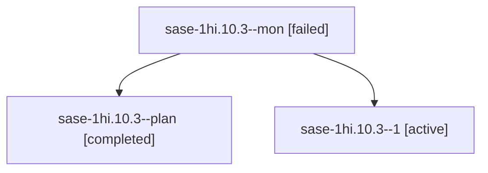

# Session: sase-1hi.10.3

[Agent Hoods](../README.md) / [bbugyi200](../users/bbugyi200/README.md) / [apollo](../users/bbugyi200/machines/apollo/README.md) / [sase-1hi](../users/bbugyi200/machines/apollo/hoods/sase-1hi/README.md) / sase-1hi.10.3

Owner: `bbugyi200.apollo` · Hood: `sase-1hi` · Members: 3 · Bead: [sase-1hi.10.3](https://github.com/sase-org/sase--beads/blob/main/pages/sase-1hi/sase-1hi.10.3.md)

## Lineage

The diagram is an optional enhancement; the ordered table below contains the same lineage in accessible text.

| Role | Agent | State | Model / provider | Timing | Commits | Prompt | Chat |
|---|---|---|---|---|---:|---|---|
| mon | sase-1hi.10.3--mon | failed | muse-spark-1.3-contributor / muse | 2026-10-08T14:29:32.977623+00:00 → 2026-10-08T14:41:44.242743+00:00 | 0 | — | [Chat](../agents/bbugyi200.apollo.sase-1hi.10.3--mon/chat.md) |
| plan | sase-1hi.10.3--plan | completed | muse-spark-1.3-contributor / muse | 2026-10-08T14:06:02.813354+00:00 → 2026-10-08T14:30:25.084613+00:00 | 0 | [Prompt](../agents/bbugyi200.apollo.sase-1hi.10.3--plan/prompt.md) | [Chat](../agents/bbugyi200.apollo.sase-1hi.10.3--plan/chat.md) |
| 1 | sase-1hi.10.3--1 | active | muse-spark-1.3-contributor / muse | 2026-10-08T14:41:44.026219+00:00 | [1](../agents/bbugyi200.apollo.sase-1hi.10.3--1/README.md#commits) | [Prompt](../agents/bbugyi200.apollo.sase-1hi.10.3--1/prompt.md) | — |

## Commits

| Role | Repo | Commit | Subject | Committed |
|---|---|---|---|---|
| 1 | sase | [`b470a1b`](https://github.com/sase-org/sase/commit/b470a1b4618156606b835ecc281357f300cf2f31) | feat(plan): decision card labels, pure validate JSON, scoped completions and CLI tests | 2026-10-08 10:56:04 EDT |

## Neighbors

| Agent | Relation | State |
|---|---|---|
| [sase-1hi.10.1](bbugyi200.apollo.sase-1hi.10.1.md) (session · 5) | sase-1hi.10 hood | completed 3, failed 2 |
| [sase-1hi.10.2](bbugyi200.apollo.sase-1hi.10.2.md) (session · 11) | sase-1hi.10 hood | completed 6, failed 5 |
| [sase-1hi.10.4](bbugyi200.apollo.sase-1hi.10.4.md) (session · 5) | sase-1hi.10 hood | active 1, completed 2, failed 2 |
| [sase-1hi.10.5](../agents/bbugyi200.apollo.sase-1hi.10.5/README.md) | sase-1hi.10 hood | waiting |
| [sase-1hi.10.6](bbugyi200.apollo.sase-1hi.10.6.md) (session · 4) | sase-1hi.10 hood | active 1, completed 2, failed 1 |
| [sase-1hi.10.land](../agents/bbugyi200.apollo.sase-1hi.10.land/README.md) | sase-1hi.10 hood | waiting |
| [sase-1hi.1](bbugyi200.apollo.sase-1hi.1.md) (session · 3) | sase-1hi hood | failed 3 |
| [sase-1hi.1.1.1](../agents/bbugyi200.apollo.sase-1hi.1.1.1/README.md) | sase-1hi hood | completed |
| [sase-1hi.1.1.2](../agents/bbugyi200.apollo.sase-1hi.1.1.2/README.md) | sase-1hi hood | completed |
| [sase-1hi.1.1.3](../agents/bbugyi200.apollo.sase-1hi.1.1.3/README.md) | sase-1hi hood | completed |
| [sase-1hi.1.1.4](../agents/bbugyi200.apollo.sase-1hi.1.1.4/README.md) | sase-1hi hood | completed |
| [sase-1hi.1.1.land](bbugyi200.apollo.sase-1hi.1.1.land.md) (session · 3) | sase-1hi hood | completed 2, failed 1 |
| [sase-1hi.2](../agents/bbugyi200.apollo.sase-1hi.2/README.md) | sase-1hi hood | completed |
| [sase-1hi.3](bbugyi200.apollo.sase-1hi.3.md) (session · 7) | sase-1hi hood | completed 4, failed 3 |
| [sase-1hi.4](../agents/bbugyi200.apollo.sase-1hi.4/README.md) | sase-1hi hood | completed |
| [sase-1hi.5](../agents/bbugyi200.apollo.sase-1hi.5/README.md) | sase-1hi hood | completed |
| [sase-1hi.6](bbugyi200.apollo.sase-1hi.6.md) (session · 7) | sase-1hi hood | completed 4, failed 3 |
| [sase-1hi.7](bbugyi200.apollo.sase-1hi.7.md) (session · 5) | sase-1hi hood | completed 3, failed 2 |
| [sase-1hi.8](bbugyi200.apollo.sase-1hi.8.md) (session · 3) | sase-1hi hood | completed 2, failed 1 |
| [sase-1hi.9](../agents/bbugyi200.apollo.sase-1hi.9/README.md) | sase-1hi hood | completed |
| [sase-1hi.land](bbugyi200.apollo.sase-1hi.land.md) (session · 3) | sase-1hi hood | failed 3 |
