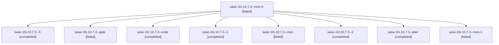

# Session: sase-1hi.10.7.3

[Agent Hoods](../README.md) / [bbugyi200](../users/bbugyi200/README.md) / [apollo](../users/bbugyi200/machines/apollo/README.md) / [sase-1hi](../users/bbugyi200/machines/apollo/hoods/sase-1hi/README.md) / sase-1hi.10.7.3

Owner: `bbugyi200.apollo` · Hood: `sase-1hi` · Members: 9 · Bead: [sase-1hi.10.7.3](https://github.com/sase-org/sase--beads/blob/main/pages/sase-1hi/sase-1hi.10.7.3.md)

## Lineage

The diagram is an optional enhancement; the ordered table below contains the same lineage in accessible text.

| Role | Agent | State | Model / provider | Timing | Commits | Prompt | Chat |
|---|---|---|---|---|---:|---|---|
| mon-0 | sase-1hi.10.7.3--mon-0 | failed | muse-spark-1.3-contributor / muse | 2026-10-08T18:23:09.931056+00:00 → 2026-10-08T18:40:46.084714+00:00 | 0 | — | [Chat](../agents/bbugyi200.apollo.sase-1hi.10.7.3--mon-0/chat.md) |
| 3 | sase-1hi.10.7.3--3 | completed | muse-spark-1.3-contributor / muse | 2026-10-08T19:44:01.805419+00:00 → 2026-10-08T19:54:10.830362+00:00 | [1](../agents/bbugyi200.apollo.sase-1hi.10.7.3--3/README.md#commits) | [Prompt](../agents/bbugyi200.apollo.sase-1hi.10.7.3--3/prompt.md) | [Chat](../agents/bbugyi200.apollo.sase-1hi.10.7.3--3/chat.md) |
| gate | sase-1hi.10.7.3--gate | failed | grok-4.7 / grok | 2026-10-08T17:29:55.652162+00:00 → 2026-10-08T17:30:07.120275+00:00 | 0 | — | [Chat](../agents/bbugyi200.apollo.sase-1hi.10.7.3--gate/chat.md) |
| code | sase-1hi.10.7.3--code | completed | muse-spark-1.3-contributor / muse | 2026-10-08T17:30:25.241900+00:00 → 2026-10-08T18:05:44.845382+00:00 | 0 | — | [Chat](../agents/bbugyi200.apollo.sase-1hi.10.7.3--code/chat.md) |
| 1 | sase-1hi.10.7.3--1 | completed | muse-spark-1.3-contributor / muse | 2026-10-08T18:18:36.013532+00:00 → 2026-10-08T18:23:43.936843+00:00 | 0 | [Prompt](../agents/bbugyi200.apollo.sase-1hi.10.7.3--1/prompt.md) | [Chat](../agents/bbugyi200.apollo.sase-1hi.10.7.3--1/chat.md) |
| mon | sase-1hi.10.7.3--mon | failed | muse-spark-1.3-contributor / muse | 2026-10-08T18:05:04.408986+00:00 → 2026-10-08T18:18:36.206163+00:00 | 0 | — | [Chat](../agents/bbugyi200.apollo.sase-1hi.10.7.3--mon/chat.md) |
| 2 | sase-1hi.10.7.3--2 | completed | muse-spark-1.3-contributor / muse | 2026-10-08T18:40:45.779185+00:00 → 2026-10-08T18:46:29.035180+00:00 | 0 | [Prompt](../agents/bbugyi200.apollo.sase-1hi.10.7.3--2/prompt.md) | [Chat](../agents/bbugyi200.apollo.sase-1hi.10.7.3--2/chat.md) |
| plan | sase-1hi.10.7.3--plan | completed | grok-4.7 / grok | 2026-10-08T17:18:08.852176+00:00 → 2026-10-08T18:05:44.845382+00:00 | 0 | [Prompt](../agents/bbugyi200.apollo.sase-1hi.10.7.3--plan/prompt.md) | [Chat](../agents/bbugyi200.apollo.sase-1hi.10.7.3--plan/chat.md) |
| mon-1 | sase-1hi.10.7.3--mon-1 | failed | muse-spark-1.3-contributor / muse | 2026-10-08T18:46:00.773994+00:00 → 2026-10-08T19:44:02.240465+00:00 | 0 | — | [Chat](../agents/bbugyi200.apollo.sase-1hi.10.7.3--mon-1/chat.md) |

## Commits

| Role | Repo | Commit | Subject | Committed |
|---|---|---|---|---|
| 3 | sase | [`b49f9bc`](https://github.com/sase-org/sase/commit/b49f9bcb2818eb89eaa282ac59ef1cf7567ef71c) | feat(ace): verdict rail fit, first-frame tint, cheap settle polling, real stale reload (sase-1hi.10.7.3) | 2026-10-08 15:48:34 EDT |

## Neighbors

| Agent | Relation | State |
|---|---|---|
| [sase-1hi.10.7.1](bbugyi200.apollo.sase-1hi.10.7.1.md) (session · 13) | sase-1hi.10.7 hood | active 1, completed 6, failed 6 |
| [sase-1hi.10.7.2](../agents/bbugyi200.apollo.sase-1hi.10.7.2/README.md) | sase-1hi.10.7 hood | completed |
| [sase-1hi.10.7.4](bbugyi200.apollo.sase-1hi.10.7.4.md) (session · 5) | sase-1hi.10.7 hood | completed 3, failed 2 |
| [sase-1hi.10.7.5](bbugyi200.apollo.sase-1hi.10.7.5.md) (session · 9) | sase-1hi.10.7 hood | completed 5, failed 4 |
| [sase-1hi.10.7.6.1](bbugyi200.apollo.sase-1hi.10.7.6.1.md) (session · 5) | sase-1hi.10.7 hood | active 5 |
| [sase-1hi.10.7.6.2](bbugyi200.apollo.sase-1hi.10.7.6.2.md) (session · 5) | sase-1hi.10.7 hood | active 5 |
| [sase-1hi.10.7.6.3](bbugyi200.apollo.sase-1hi.10.7.6.3.md) (session · 3) | sase-1hi.10.7 hood | active 3 |
| [sase-1hi.10.7.6.4](bbugyi200.apollo.sase-1hi.10.7.6.4.md) (session · 5) | sase-1hi.10.7 hood | active 1, completed 1, failed 3 |
| [sase-1hi.10.7.6.land](bbugyi200.apollo.sase-1hi.10.7.6.land.md) (session · 3) | sase-1hi.10.7 hood | active 2, failed 1 |
| [sase-1hi.10.7.6.land](../agents/bbugyi200.apollo.sase-1hi.10.7.6.land/README.md) | sase-1hi.10.7 hood | waiting |
| [sase-1hi.10.7.land](bbugyi200.apollo.sase-1hi.10.7.land.md) (session · 3) | sase-1hi.10.7 hood | failed 3 |
| [sase-1hi.10.1](bbugyi200.apollo.sase-1hi.10.1.md) (session · 5) | sase-1hi.10 hood | active 3, completed 1, failed 1 |
| [sase-1hi.10.2](bbugyi200.apollo.sase-1hi.10.2.md) (session · 11) | sase-1hi.10 hood | active 9, completed 1, failed 1 |
| [sase-1hi.10.3](bbugyi200.apollo.sase-1hi.10.3.md) (session · 3) | sase-1hi.10 hood | active 3 |
| [sase-1hi.10.4](bbugyi200.apollo.sase-1hi.10.4.md) (session · 5) | sase-1hi.10 hood | active 3, completed 1, failed 1 |
| [sase-1hi.10.5](bbugyi200.apollo.sase-1hi.10.5.md) (session · 3) | sase-1hi.10 hood | active 3 |
| [sase-1hi.10.6](bbugyi200.apollo.sase-1hi.10.6.md) (session · 7) | sase-1hi.10 hood | active 5, completed 1, failed 1 |
| [sase-1hi.10.land](bbugyi200.apollo.sase-1hi.10.land.md) (session · 3) | sase-1hi.10 hood | active 3 |
| [sase-1hi.1](bbugyi200.apollo.sase-1hi.1.md) (session · 3) | sase-1hi hood | active 3 |
| [sase-1hi.1.1.1](../agents/bbugyi200.apollo.sase-1hi.1.1.1/README.md) | sase-1hi hood | active |
| [sase-1hi.1.1.2](../agents/bbugyi200.apollo.sase-1hi.1.1.2/README.md) | sase-1hi hood | active |
| [sase-1hi.1.1.3](../agents/bbugyi200.apollo.sase-1hi.1.1.3/README.md) | sase-1hi hood | active |
| [sase-1hi.1.1.4](../agents/bbugyi200.apollo.sase-1hi.1.1.4/README.md) | sase-1hi hood | active |
| [sase-1hi.1.1.land](bbugyi200.apollo.sase-1hi.1.1.land.md) (session · 3) | sase-1hi hood | active 2, completed 1 |
| [sase-1hi.2](../agents/bbugyi200.apollo.sase-1hi.2/README.md) | sase-1hi hood | active |
| [sase-1hi.3](bbugyi200.apollo.sase-1hi.3.md) (session · 7) | sase-1hi hood | active 5, completed 1, failed 1 |
| [sase-1hi.4](../agents/bbugyi200.apollo.sase-1hi.4/README.md) | sase-1hi hood | active |
| [sase-1hi.5](../agents/bbugyi200.apollo.sase-1hi.5/README.md) | sase-1hi hood | active |
| [sase-1hi.6](bbugyi200.apollo.sase-1hi.6.md) (session · 7) | sase-1hi hood | active 5, completed 1, failed 1 |
| [sase-1hi.7](bbugyi200.apollo.sase-1hi.7.md) (session · 5) | sase-1hi hood | active 3, completed 1, failed 1 |
| [sase-1hi.8](bbugyi200.apollo.sase-1hi.8.md) (session · 3) | sase-1hi hood | active 3 |
| [sase-1hi.9](../agents/bbugyi200.apollo.sase-1hi.9/README.md) | sase-1hi hood | active |
| [sase-1hi.land](bbugyi200.apollo.sase-1hi.land.md) (session · 3) | sase-1hi hood | active 3 |
