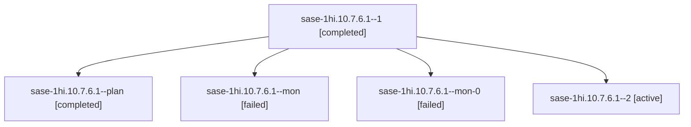

# Session: sase-1hi.10.7.6.1

[Agent Hoods](../README.md) / [bbugyi200](../users/bbugyi200/README.md) / [apollo](../users/bbugyi200/machines/apollo/README.md) / [sase-1hi](../users/bbugyi200/machines/apollo/hoods/sase-1hi/README.md) / sase-1hi.10.7.6.1

Owner: `bbugyi200.apollo` · Hood: `sase-1hi` · Members: 5 · Bead: [sase-1hi.10.7.6.1](https://github.com/sase-org/sase--beads/blob/main/pages/sase-1hi/sase-1hi.10.7.6.1.md)

## Lineage

The diagram is an optional enhancement; the ordered table below contains the same lineage in accessible text.

| Role | Agent | State | Model / provider | Timing | Commits | Prompt | Chat |
|---|---|---|---|---|---:|---|---|
| 1 | sase-1hi.10.7.6.1--1 | completed | muse-spark-1.3-contributor / muse | 2026-10-09T02:30:19.137808+00:00 → 2026-10-09T03:53:47.051918+00:00 | 0 | [Prompt](../agents/bbugyi200.apollo.sase-1hi.10.7.6.1--1/prompt.md) | [Chat](../agents/bbugyi200.apollo.sase-1hi.10.7.6.1--1/chat.md) |
| plan | sase-1hi.10.7.6.1--plan | completed | muse-spark-1.3-contributor / muse | 2026-10-08T23:17:00.371800+00:00 → 2026-10-09T01:27:07.502835+00:00 | 0 | [Prompt](../agents/bbugyi200.apollo.sase-1hi.10.7.6.1--plan/prompt.md) | [Chat](../agents/bbugyi200.apollo.sase-1hi.10.7.6.1--plan/chat.md) |
| mon | sase-1hi.10.7.6.1--mon | failed | muse-spark-1.3-contributor / muse | 2026-10-09T01:24:46.711214+00:00 → 2026-10-09T02:28:08.058180+00:00 | 0 | — | [Chat](../agents/bbugyi200.apollo.sase-1hi.10.7.6.1--mon/chat.md) |
| mon-0 | sase-1hi.10.7.6.1--mon-0 | failed | muse-spark-1.3-contributor / muse | 2026-10-09T02:56:10.095424+00:00 → 2026-10-09T03:58:31.675786+00:00 | 0 | — | [Chat](../agents/bbugyi200.apollo.sase-1hi.10.7.6.1--mon-0/chat.md) |
| 2 | sase-1hi.10.7.6.1--2 | active | muse-spark-1.3-contributor / muse | 2026-10-09T04:27:11.366931+00:00 | [1](../agents/bbugyi200.apollo.sase-1hi.10.7.6.1--2/README.md#commits) | [Prompt](../agents/bbugyi200.apollo.sase-1hi.10.7.6.1--2/prompt.md) | — |

## Commits

| Role | Repo | Commit | Subject | Committed |
|---|---|---|---|---|
| 2 | sase | [`1820636`](https://github.com/sase-org/sase/commit/1820636212abb2a056f7892ead0c42ea7cb5e09e) | feat(ace): rendered chosen-branch tint, stale reopen via real open path, 42-cell generic rails | 2026-10-09 00:42:16 EDT |

## Neighbors

| Agent | Relation | State |
|---|---|---|
| [sase-1hi.10.7.6.2](../agents/bbugyi200.apollo.sase-1hi.10.7.6.2/README.md) | sase-1hi.10.7.6 hood | waiting |
| [sase-1hi.10.7.6.3](bbugyi200.apollo.sase-1hi.10.7.6.3.md) (session · 3) | sase-1hi.10.7.6 hood | completed 2, failed 1 |
| [sase-1hi.10.7.6.4](bbugyi200.apollo.sase-1hi.10.7.6.4.md) (session · 5) | sase-1hi.10.7.6 hood | completed 2, failed 3 |
| [sase-1hi.10.7.6.land](../agents/bbugyi200.apollo.sase-1hi.10.7.6.land/README.md) | sase-1hi.10.7.6 hood | waiting |
| [sase-1hi.10.7.1](bbugyi200.apollo.sase-1hi.10.7.1.md) (session · 13) | sase-1hi.10.7 hood | completed 7, failed 6 |
| [sase-1hi.10.7.2](../agents/bbugyi200.apollo.sase-1hi.10.7.2/README.md) | sase-1hi.10.7 hood | completed |
| [sase-1hi.10.7.3](bbugyi200.apollo.sase-1hi.10.7.3.md) (session · 9) | sase-1hi.10.7 hood | completed 5, failed 4 |
| [sase-1hi.10.7.4](bbugyi200.apollo.sase-1hi.10.7.4.md) (session · 5) | sase-1hi.10.7 hood | completed 3, failed 2 |
| [sase-1hi.10.7.5](bbugyi200.apollo.sase-1hi.10.7.5.md) (session · 9) | sase-1hi.10.7 hood | completed 5, failed 4 |
| [sase-1hi.10.7.land](bbugyi200.apollo.sase-1hi.10.7.land.md) (session · 3) | sase-1hi.10.7 hood | failed 3 |
| [sase-1hi.10.1](bbugyi200.apollo.sase-1hi.10.1.md) (session · 5) | sase-1hi.10 hood | completed 3, failed 2 |
| [sase-1hi.10.2](bbugyi200.apollo.sase-1hi.10.2.md) (session · 11) | sase-1hi.10 hood | completed 6, failed 5 |
| [sase-1hi.10.3](bbugyi200.apollo.sase-1hi.10.3.md) (session · 3) | sase-1hi.10 hood | completed 2, failed 1 |
| [sase-1hi.10.4](bbugyi200.apollo.sase-1hi.10.4.md) (session · 5) | sase-1hi.10 hood | completed 3, failed 2 |
| [sase-1hi.10.5](bbugyi200.apollo.sase-1hi.10.5.md) (session · 3) | sase-1hi.10 hood | completed 2, failed 1 |
| [sase-1hi.10.6](bbugyi200.apollo.sase-1hi.10.6.md) (session · 7) | sase-1hi.10 hood | completed 4, failed 3 |
| [sase-1hi.10.land](bbugyi200.apollo.sase-1hi.10.land.md) (session · 3) | sase-1hi.10 hood | failed 3 |
| [sase-1hi.1](bbugyi200.apollo.sase-1hi.1.md) (session · 3) | sase-1hi hood | failed 3 |
| [sase-1hi.1.1.1](../agents/bbugyi200.apollo.sase-1hi.1.1.1/README.md) | sase-1hi hood | completed |
| [sase-1hi.1.1.2](../agents/bbugyi200.apollo.sase-1hi.1.1.2/README.md) | sase-1hi hood | completed |
| [sase-1hi.1.1.3](../agents/bbugyi200.apollo.sase-1hi.1.1.3/README.md) | sase-1hi hood | completed |
| [sase-1hi.1.1.4](../agents/bbugyi200.apollo.sase-1hi.1.1.4/README.md) | sase-1hi hood | completed |
| [sase-1hi.1.1.land](bbugyi200.apollo.sase-1hi.1.1.land.md) (session · 3) | sase-1hi hood | completed 2, failed 1 |
| [sase-1hi.2](../agents/bbugyi200.apollo.sase-1hi.2/README.md) | sase-1hi hood | completed |
| [sase-1hi.3](bbugyi200.apollo.sase-1hi.3.md) (session · 7) | sase-1hi hood | completed 4, failed 3 |
| [sase-1hi.4](../agents/bbugyi200.apollo.sase-1hi.4/README.md) | sase-1hi hood | completed |
| [sase-1hi.5](../agents/bbugyi200.apollo.sase-1hi.5/README.md) | sase-1hi hood | completed |
| [sase-1hi.6](bbugyi200.apollo.sase-1hi.6.md) (session · 7) | sase-1hi hood | completed 4, failed 3 |
| [sase-1hi.7](bbugyi200.apollo.sase-1hi.7.md) (session · 5) | sase-1hi hood | completed 3, failed 2 |
| [sase-1hi.8](bbugyi200.apollo.sase-1hi.8.md) (session · 3) | sase-1hi hood | completed 2, failed 1 |
| [sase-1hi.9](../agents/bbugyi200.apollo.sase-1hi.9/README.md) | sase-1hi hood | completed |
| [sase-1hi.land](bbugyi200.apollo.sase-1hi.land.md) (session · 3) | sase-1hi hood | failed 3 |
