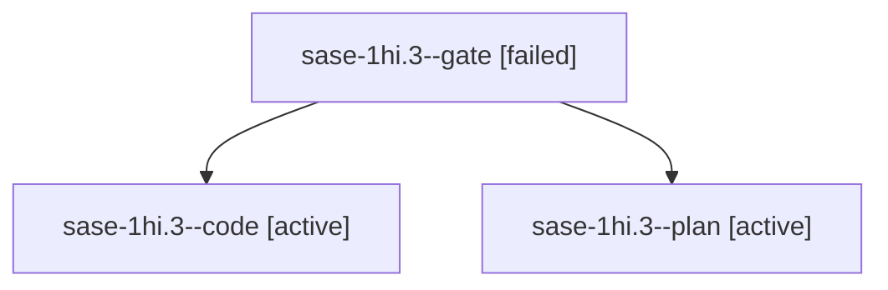

# Session: sase-1hi.3

[Agent Hoods](../README.md) / [bbugyi200](../users/bbugyi200/README.md) / [apollo](../users/bbugyi200/machines/apollo/README.md) / [sase-1hi](../users/bbugyi200/machines/apollo/hoods/sase-1hi/README.md) / sase-1hi.3

Owner: `bbugyi200.apollo` · Hood: `sase-1hi` · Members: 3 · Bead: [sase-1hi.3](https://github.com/sase-org/sase--beads/blob/main/pages/sase-1hi/sase-1hi.3.md)

## Lineage

The diagram is an optional enhancement; the ordered table below contains the same lineage in accessible text.

| Role | Agent | State | Model / provider | Timing | Commits | Prompt | Chat |
|---|---|---|---|---|---:|---|---|
| gate | sase-1hi.3--gate | failed | grok-4.7 / grok | 2026-10-08T02:42:38.805462+00:00 → 2026-10-08T02:42:51.332932+00:00 | 0 | — | [Chat](../agents/bbugyi200.apollo.sase-1hi.3--gate/chat.md) |
| code | sase-1hi.3--code | active | muse-spark-1.3-contributor / muse | 2026-10-08T02:43:11.184055+00:00 | 0 | — | — |
| plan | sase-1hi.3--plan | active | grok-4.7 / grok | 2026-10-08T02:33:46.949226+00:00 | 0 | [Prompt](../agents/bbugyi200.apollo.sase-1hi.3--plan/prompt.md) | [Chat](../agents/bbugyi200.apollo.sase-1hi.3--plan/chat.md) |

## Neighbors

| Agent | Relation | State |
|---|---|---|
| [sase-1hi.1](bbugyi200.apollo.sase-1hi.1.md) (session · 3) | sase-1hi hood | failed 3 |
| [sase-1hi.1.1.1](../agents/bbugyi200.apollo.sase-1hi.1.1.1/README.md) | sase-1hi hood | completed |
| [sase-1hi.1.1.2](../agents/bbugyi200.apollo.sase-1hi.1.1.2/README.md) | sase-1hi hood | completed |
| [sase-1hi.1.1.3](../agents/bbugyi200.apollo.sase-1hi.1.1.3/README.md) | sase-1hi hood | completed |
| [sase-1hi.1.1.4](../agents/bbugyi200.apollo.sase-1hi.1.1.4/README.md) | sase-1hi hood | completed |
| [sase-1hi.1.1.land](bbugyi200.apollo.sase-1hi.1.1.land.md) (session · 3) | sase-1hi hood | active 2, failed 1 |
| [sase-1hi.2](../agents/bbugyi200.apollo.sase-1hi.2/README.md) | sase-1hi hood | completed |
| [sase-1hi.4](../agents/bbugyi200.apollo.sase-1hi.4/README.md) | sase-1hi hood | waiting |
| [sase-1hi.5](../agents/bbugyi200.apollo.sase-1hi.5/README.md) | sase-1hi hood | waiting |
| [sase-1hi.6](../agents/bbugyi200.apollo.sase-1hi.6/README.md) | sase-1hi hood | waiting |
| [sase-1hi.7](../agents/bbugyi200.apollo.sase-1hi.7/README.md) | sase-1hi hood | waiting |
| [sase-1hi.8](../agents/bbugyi200.apollo.sase-1hi.8/README.md) | sase-1hi hood | waiting |
| [sase-1hi.9](../agents/bbugyi200.apollo.sase-1hi.9/README.md) | sase-1hi hood | waiting |
| [sase-1hi.land](../agents/bbugyi200.apollo.sase-1hi.land/README.md) | sase-1hi hood | waiting |
