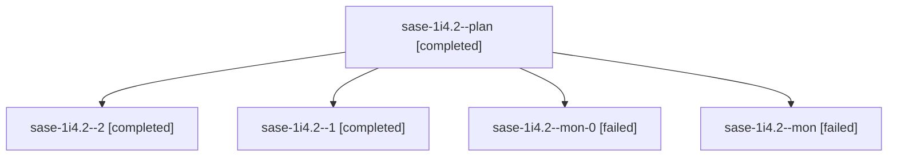

# Session: sase-1i4.2

[Agent Hoods](../README.md) / [bbugyi200](../users/bbugyi200/README.md) / [apollo](../users/bbugyi200/machines/apollo/README.md) / [sase-1i4](../users/bbugyi200/machines/apollo/hoods/sase-1i4/README.md) / sase-1i4.2

Owner: `bbugyi200.apollo` · Hood: `sase-1i4` · Members: 5 · Bead: [sase-1i4.2](https://github.com/sase-org/sase--beads/blob/main/pages/sase-1i4/sase-1i4.2.md)

## Lineage

The diagram is an optional enhancement; the ordered table below contains the same lineage in accessible text.

| Role | Agent | State | Model / provider | Timing | Commits | Prompt | Chat |
|---|---|---|---|---|---:|---|---|
| plan | sase-1i4.2--plan | completed | muse-spark-1.3-contributor / muse | 2026-10-08T10:58:42.478288+00:00 → 2026-10-08T11:14:56.065126+00:00 | 0 | [Prompt](../agents/bbugyi200.apollo.sase-1i4.2--plan/prompt.md) | [Chat](../agents/bbugyi200.apollo.sase-1i4.2--plan/chat.md) |
| 2 | sase-1i4.2--2 | completed | muse-spark-1.3-contributor / muse | 2026-10-08T11:45:40.683304+00:00 → 2026-10-08T12:06:35.658103+00:00 | [1](../agents/bbugyi200.apollo.sase-1i4.2--2/README.md#commits) | [Prompt](../agents/bbugyi200.apollo.sase-1i4.2--2/prompt.md) | [Chat](../agents/bbugyi200.apollo.sase-1i4.2--2/chat.md) |
| 1 | sase-1i4.2--1 | completed | muse-spark-1.3-contributor / muse | 2026-10-08T11:15:36.910251+00:00 → 2026-10-08T11:43:54.229230+00:00 | 0 | [Prompt](../agents/bbugyi200.apollo.sase-1i4.2--1/prompt.md) | [Chat](../agents/bbugyi200.apollo.sase-1i4.2--1/chat.md) |
| mon-0 | sase-1i4.2--mon-0 | failed | muse-spark-1.3-contributor / muse | 2026-10-08T11:42:52.781174+00:00 → 2026-10-08T11:45:40.896340+00:00 | 0 | — | [Chat](../agents/bbugyi200.apollo.sase-1i4.2--mon-0/chat.md) |
| mon | sase-1i4.2--mon | failed | muse-spark-1.3-contributor / muse | 2026-10-08T11:14:17.009478+00:00 → 2026-10-08T11:15:36.970233+00:00 | 0 | — | [Chat](../agents/bbugyi200.apollo.sase-1i4.2--mon/chat.md) |

## Commits

| Role | Repo | Commit | Subject | Committed |
|---|---|---|---|---|
| 2 | sase | [`e4b0faf`](https://github.com/sase-org/sase/commit/e4b0faf443accef65ebc2a78612f4f92dc9c3151) | feat(scope): runner sweeps its own agent scope on exit and turn boundaries | 2026-10-08 08:01:18 EDT |

## Neighbors

| Agent | Relation | State |
|---|---|---|
| [sase-1i4.1](../agents/bbugyi200.apollo.sase-1i4.1/README.md) | sase-1i4 hood | completed |
| [sase-1i4.3](bbugyi200.apollo.sase-1i4.3.md) (session · 9) | sase-1i4 hood | active 1, completed 4, failed 4 |
| [sase-1i4.land](../agents/bbugyi200.apollo.sase-1i4.land/README.md) | sase-1i4 hood | waiting |
