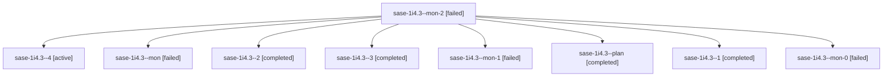

# Session: sase-1i4.3

[Agent Hoods](../README.md) / [bbugyi200](../users/bbugyi200/README.md) / [apollo](../users/bbugyi200/machines/apollo/README.md) / [sase-1i4](../users/bbugyi200/machines/apollo/hoods/sase-1i4/README.md) / sase-1i4.3

Owner: `bbugyi200.apollo` · Hood: `sase-1i4` · Members: 9 · Bead: [sase-1i4.3](https://github.com/sase-org/sase--beads/blob/main/pages/sase-1i4/sase-1i4.3.md)

## Lineage

The diagram is an optional enhancement; the ordered table below contains the same lineage in accessible text.

| Role | Agent | State | Model / provider | Timing | Commits | Prompt | Chat |
|---|---|---|---|---|---:|---|---|
| mon-2 | sase-1i4.3--mon-2 | failed | muse-spark-1.3-contributor / muse | 2026-10-08T13:28:05.648256+00:00 → 2026-10-08T13:38:21.846869+00:00 | 0 | — | [Chat](../agents/bbugyi200.apollo.sase-1i4.3--mon-2/chat.md) |
| 4 | sase-1i4.3--4 | active | muse-spark-1.3-contributor / muse | 2026-10-08T13:38:21.280449+00:00 | [1](../agents/bbugyi200.apollo.sase-1i4.3--4/README.md#commits) | [Prompt](../agents/bbugyi200.apollo.sase-1i4.3--4/prompt.md) | — |
| mon | sase-1i4.3--mon | failed | muse-spark-1.3-contributor / muse | 2026-10-08T12:19:21.935989+00:00 → 2026-10-08T12:25:51.944133+00:00 | 0 | — | [Chat](../agents/bbugyi200.apollo.sase-1i4.3--mon/chat.md) |
| 2 | sase-1i4.3--2 | completed | muse-spark-1.3-contributor / muse | 2026-10-08T12:35:50.633123+00:00 → 2026-10-08T12:48:42.792591+00:00 | 0 | [Prompt](../agents/bbugyi200.apollo.sase-1i4.3--2/prompt.md) | [Chat](../agents/bbugyi200.apollo.sase-1i4.3--2/chat.md) |
| 3 | sase-1i4.3--3 | completed | muse-spark-1.3-contributor / muse | 2026-10-08T13:11:55.882910+00:00 → 2026-10-08T13:28:59.321931+00:00 | 0 | [Prompt](../agents/bbugyi200.apollo.sase-1i4.3--3/prompt.md) | [Chat](../agents/bbugyi200.apollo.sase-1i4.3--3/chat.md) |
| mon-1 | sase-1i4.3--mon-1 | failed | muse-spark-1.3-contributor / muse | 2026-10-08T12:47:58.453725+00:00 → 2026-10-08T13:11:56.157644+00:00 | 0 | — | [Chat](../agents/bbugyi200.apollo.sase-1i4.3--mon-1/chat.md) |
| plan | sase-1i4.3--plan | completed | muse-spark-1.3-contributor / muse | 2026-10-08T12:06:12.892778+00:00 → 2026-10-08T12:20:04.068437+00:00 | 0 | [Prompt](../agents/bbugyi200.apollo.sase-1i4.3--plan/prompt.md) | [Chat](../agents/bbugyi200.apollo.sase-1i4.3--plan/chat.md) |
| 1 | sase-1i4.3--1 | completed | muse-spark-1.3-contributor / muse | 2026-10-08T12:25:51.643702+00:00 → 2026-10-08T12:30:30.291080+00:00 | 0 | [Prompt](../agents/bbugyi200.apollo.sase-1i4.3--1/prompt.md) | [Chat](../agents/bbugyi200.apollo.sase-1i4.3--1/chat.md) |
| mon-0 | sase-1i4.3--mon-0 | failed | muse-spark-1.3-contributor / muse | 2026-10-08T12:29:49.940402+00:00 → 2026-10-08T12:35:51.037214+00:00 | 0 | — | [Chat](../agents/bbugyi200.apollo.sase-1i4.3--mon-0/chat.md) |

## Commits

| Role | Repo | Commit | Subject | Committed |
|---|---|---|---|---|
| 4 | sase | [`a10a6c6`](https://github.com/sase-org/sase/commit/a10a6c60352667d856f4c697134ba4df5fa243a1) | feat(scope): reap orphaned agent scopes with checks-routine backstop job | 2026-10-08 09:50:02 EDT |

## Neighbors

| Agent | Relation | State |
|---|---|---|
| [sase-1i4.1](../agents/bbugyi200.apollo.sase-1i4.1/README.md) | sase-1i4 hood | completed |
| [sase-1i4.2](bbugyi200.apollo.sase-1i4.2.md) (session · 5) | sase-1i4 hood | completed 3, failed 2 |
| [sase-1i4.land](../agents/bbugyi200.apollo.sase-1i4.land/README.md) | sase-1i4 hood | waiting |
